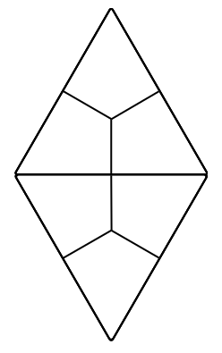
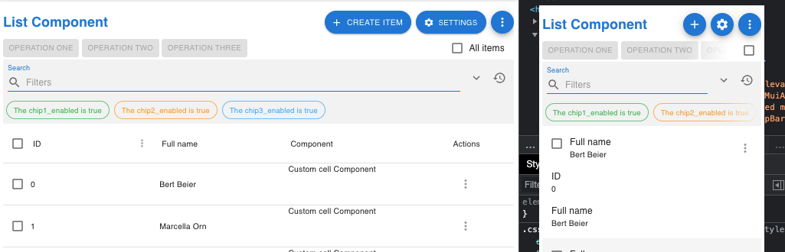
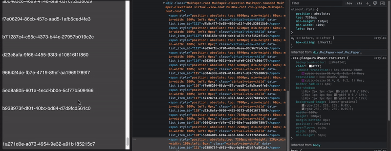
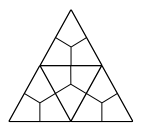

<!--img src="./assets/icons/logo.svg" height="35px" align="right"-->

# ⚛️ react-declarative

> [MUI](https://mui.com/) json endpoint form builder. Check [this storybook](https://github.com/react-declarative/react-declarative-storybook) for more samples...

[](https://npmjs.org/package/react-declarative)


A React view builder which interacts with a JSON endpoint to generate nested 12-column grids with input fields and automatic state management in a declarative style. Endpoint is typed by TypeScript guards (**IntelliSense** available). This tool is based on `MUI` components, so your application will look beautiful on any device...


## Briefing (optional to read)

> What is the declarative programming?

Declarative programming is when a more qualified specialist writing code in a way when its behavior can be changed by using external config which represent oriented graph of objects. For example, [Jetpack Compose](https://developer.android.com/jetpack/compose) or [Flutter Widgets](https://docs.flutter.dev/development/ui/widgets).

Legacy solutions had used an xml-like markup languages which represented ui object tree. For example, [XAML in WPF](https://learn.microsoft.com/en-us/dotnet/desktop/wpf/xaml) (see [FuncUI](https://funcui.avaloniaui.net/)) or [*.ui in Qt](https://doc.qt.io/qt-6/designer-using-a-ui-file.html). But after [Facebook introduced JSX](https://reactjs.org/docs/introducing-jsx.html) the whole enterprise migrated to web because it gives to developer more accessibility to design features and customize user experience by using `functional programming` (code significantly cheaper). In that case, `JSX` is declarative to `HTML`

If you studied computer science you must know that everything in software [is built on top of abstractions](https://en.wikipedia.org/wiki/Architecture_of_macOS). For example in macOS `hardware` is used by `mach kernel`. `Mach kernel` is used by `Core OS`. `Core OS` is used by `QuckTime`. `QuickTime` is used by `GUI`. 

My idea is simple. If `C/C++ language` is declarative to `assembly`, `JavaScript` is declarative to `C++`, `React` is declarative to `JavaScript` why don't we build something which will reduce cost of app development when using React?

As a result I had implemented a framework which can handle [the most cases of material guidelines](https://m2.material.io/components) usage with avalibility to fallback into vanilla JSX way of React development. That tool makes your code more functional because It removes the mostly used imperative parts of the virgin source code.

So this is definitely the next step on the direction based on top of historical evolution of the UI development way. The community has come up with a new term to define this phenomenon, It called [low code](https://en.wikipedia.org/wiki/Low-code_development_platform).

The `react-declarative` framework is the best low code solution because you still have `webpack`, `node_modules`, `package.json` and the full control on the source code.


## Quick start

> There is a `create-react-app` template available [in this repository](https://github.com/react-declarative/cra-template-react-declarative)

```bash
yarn create react-app --template cra-template-react-declarative .
```

or

```bash
npx create-react-app . --template=react-declarative
```

## Installation

> There is a sample app avalible in [demo](./demo/src/index.tsx) folder...

```bash
npm install --save react-declarative tss-react @mui/material @emotion/react @emotion/styled
```

## Demos

> The `react-declarative` is not just a form builder. This one is the huge framework with dashboard adaptive cards builder, crud-based Grid component and more.

This tool also provide it's own way of rapid application development by simplifying app state managament. New features appear frequently, so you should be able to [read the project's storybook](https://github.com/react-declarative/react-declarative-storybook), browse [an organization with sample projects](https://github.com/react-declarative), and [read the source code](https://github.com/react-declarative/react-declarative).

Also, several starter kits available

**1. Pure React Starter**

> GitHub repo: [https://github.com/react-declarative/cra-template-react-declarative](https://github.com/react-declarative/cra-template-react-declarative)

```bash
yarn create react-app --template cra-template-react-declarative .
```

**2. Ethers.js/React Starter**

> GitHub repo: [https://github.com/react-declarative/cra-template-solidity](https://github.com/react-declarative/cra-template-solidity)

```bash
yarn create react-app --template cra-template-solidity .
```

**3. AppWrite/React Starter**

> GitHub repo: [https://github.com/react-declarative/cra-template-appwrite](https://github.com/react-declarative/cra-template-appwrite)

```bash
yarn create react-app --template cra-template-appwrite .
```


## Declarative Scaffold component

> Link to [source code](./demo/src/App.Scaffold2.tsx)

The `<Scaffold2 />` implements the basic Material Design visual layout structure by using config instead of manual ui elements composition. 


```tsx
const options: IScaffold2Group[] = [
  {
    id: 'build',
    label: 'Build',
    children: [
      {
        id: 'authentication',
        label: 'Authentication',
        isVisible: async () => await ioc.authService.hasRole('unauthorized'),
        icon: PeopleIcon,
        tabs: [
          { id: 'tab1', label: 'Tab1 in header', },
          { id: 'tab2', label: 'Tab2 in header', },
        ],
        options: [
          { id: 'tab1', label: 'Tab1 in side menu' },
          { id: 'tab2', label: 'Tab2 in side menu' },
        ],
      },
      { id: 'Database', label: 'Label is optional (can be generated automatically from ID in snake case)', icon: DnsRoundedIcon, },
      { id: 'Storage', isDisabled: async () => await myAmazingGuard(), icon: PermMediaOutlinedIcon, },
      { id: 'Hosting', icon: PublicIcon, },

      ...

```



## JSON-templated view engine

**1. Layout grid**

> Link to [source code](./demo/src/pages/LayoutPage.tsx)


```tsx
const fields: TypedField[] = [
  {
    type: FieldType.Line,
    title: 'User info',
  },
  {
    type: FieldType.Group,
    phoneColumns: '12',
    tabletColumns: '6',
    desktopColumns: '4',
    fields: [
      {
        type: FieldType.Text,
        title: 'First name',
        defaultValue: 'Petr',
        description: 'Your first name',
        leadingIcon: Face,
        focus() { console.log("focus :-)"); },
        blur() { console.log("blur :-("); },
        name: 'firstName',
      },
      {
        type: FieldType.Text,
        title: 'Last name',
        defaultValue: 'Tripolsky',
        description: 'Your last name',
        name: 'lastName',
      },

      ...

];
```

**2. Form validation**

> Link to [source code](./demo/src/pages/ValidationPage.tsx)


```tsx
const fields: TypedField[] = [
  {
    type: FieldType.Text,
    name: 'email',
    trailingIcon: Email,
    defaultValue: 'tripolskypetr@gmail.com',
    isInvalid({email}) {
      const expr = /^[\w-.]+@([\w-]+\.)+[\w-]{2,4}$/g;
      if (!expr.test(email)) {
        return 'Invalid email address';
      } else {
        return null;
      }
    },
    isDisabled({disabled}) {
      return disabled;
    },
    isVisible({visible}) {
      return visible;
    }
},
{
    type: FieldType.Expansion,
    title: 'Settings',
    description: 'Hide or disable',
    fields: [
      {
        type: FieldType.Switch,
        title: 'Mark as visible',
        name: 'visible',
        defaultValue: true,
      },

      ...

```

**3. Gallery of controls**

> Link to [source code](./demo/src/pages/GalleryPage.tsx)


```tsx
const fields: TypedField[] = [
  {
    type: FieldType.Paper,
    fields: [
      {
        type: FieldType.Line,
        title: 'Checkboxes',
      },
      {
        type: FieldType.Checkbox,
        name: 'checkbox1',
        columns: '3',
        title: 'Checkbox 1',
      },
      {
        type: FieldType.Checkbox,
        name: 'checkbox2',
        columns: '3',
        title: 'Checkbox 2',
      },

      ...

```

**4. JSX Injection**

> Link to [source code](./demo/src/pages/GalleryPage.tsx)

```tsx
const fields: TypedField[] = [
  {
    type: FieldType.Paper,
    fields: [
      {
        type: FieldType.Component,
        element: (props) => <Logger {...(props || {})}/>, 
      },
    ],
  },

  ...

];
```


## JSON-templated grid engine

> Link to [source code](./demo/src/pages/ListPage.tsx)

Adaptive json-configurable data grid with build-in mobile device support



```tsx

const filters: TypedField[] = [
  {
    type: FieldType.Text,
    name: 'firstName',
    title: 'First name',
  },
  {
    type: FieldType.Text,
    name: 'lastName',
    title: 'Last name',
  }
];

const columns: IColumn[] = [
  {
    type: ColumnType.Text,
    field: 'id',
    headerName: 'ID',
    width: (fullWidth) => Math.max(fullWidth - 650, 200),
    columnMenu: [
      {
        action: 'test-action',
        label: 'Column action',
      },
    ],
  },
  ...
];

const actions: IListAction[] = [
  {
    type: ActionType.Add,
    label: 'Create item'
  },
  ...
];

const operations: IListOperation[] = [
  {
    action: 'operation-one',
    label: 'Operation one',
  },
];

const chips: IListChip[] = [
  {
    label: 'The chip1_enabled is true',
    name: 'chip1_enabled',
    color: '#4caf50',
  },
  ...
];

const rowActions: IListRowAction[] = [
  {
    label: 'chip1',
    action: 'chip1-action',
    isVisible: ({ chip1_enabled }) => chip1_enabled,
  },
  ...
];

...

return (
  <ListTyped
    withMobile
    withSearch
    withArrowPagination
    rowActions={rowActions}
    actions={actions}
    filters={filters}
    columns={columns}
    operations={operations}
    chips={chips}
  />
)

```


## DOM Frames with infinite scroll and `transparent-api virtualization`

> You can use [InfiniteView](./src/components/InfiniteView/InfiniteView.tsx) for always-mounted or [VirtualView](./src/components/VirtualView/VirtualView.tsx) for virtualized infinite lists 



```tsx
<VirtualView
  component={Paper}
  sx={{
    width: "100%",
    height: 250,
    mb: 1,
  }}
  onDataRequest={() => {
    console.log('data-request');
    setItems((items) => [
      ...items,
      ...[uuid(), uuid(), uuid(), uuid(), uuid()],
    ]);
  }}
>
  {items.map((item) => (
    <span key={item}>{item}</span>
  ))}
</VirtualView>
```


## Async pipe port

> See [angular2 docs](https://angular.io/api/common/AsyncPipe)

```tsx
import { Async } from 'react-declarative'

import { CircularProgress } from '@mui/material'

const PostItem = ({
  id,
}) => {

  const { getPostById } = useBlogApi();

  return (
    <Async payload={id} Loader={CircularProgress}>
      {async (id) => {
        const { title, body } = await getPostById(id);
        return (
          <div>
            <p>{title}</p>
            <p>{body}</p>
          </div>
        );
      }}
    </Async>
  );
};
```



## Structural directive port

> See [angular2 docs](https://angular.io/guide/structural-directives)

```tsx
import { If } from 'react-declarative'

const ProfilePage = () => {
  const { hasRole } = useRoleApi();
  return (
    <If condition={() => hasRole("admin")}>
      <button>The admin's button</button>
    </If>
  );
};
```


## Animated view transition

> Link to [source code](./demo/src/pages/RevealPage.tsx)

```tsx
import { FetchView } from 'react-declarative'

const PostList = () => {

  const { getPosts } = useBlogApi();

  const state = [
    getPosts,
  ];

  return (
    <FetchView state={state} animation="fadeIn">
      {(posts) => (
        <div>
          {posts.map((post, idx) => (
            <p key={idx}>
              <b>{post.title}</b>
              {post.body}
            </p>
          ))}
        </div>
      )}
    </FetchView>
  );
};
```


## Build-in router

> Link to [source code](./demo/src/App.tsx)

```tsx
import { Switch } from 'react-declarative';

...

const routes = [
  {
    path: '/mint-page',
    guard: async () => await ioc.roleService.has('whitelist'),
    prefetch: async () => await ioc.ethersService.init(),
    unload: async () => await ioc.ethersService.dispose(),
    redirect: () => {
      let isOk = true;
      isOk = isOk && ioc.ethersService.isMetamaskAvailable;
      isOk = isOk && ioc.ethersService.isProviderConnected;
      isOk = isOk && ioc.ethersService.isAccountEnabled;
      if (isOk) {
        return "/connect-page";
      }
      return null;
    },
  },
];

...

const App = () => (
  <Switch history={history} items={routes} />
);
```


## See also

```tsx
import { ConstraintView } from 'react-declarative';
import { DragDropView } from 'react-declarative';
import { ScrollView } from 'react-declarative';
import { ScaleView } from 'react-declarative';
import { FadeView } from 'react-declarative';
import { TabsView } from 'react-declarative';
import { WaitView } from 'react-declarative';
import { PingView } from 'react-declarative';
import { OfflineView } from 'react-declarative';
import { RevealView } from 'react-declarative';
import { SecretView } from 'react-declarative';
import { PortalView } from 'react-declarative';
import { RecordView } from 'react-declarative';
import { CardView } from 'react-declarative';
import { ErrorView } from 'react-declarative';
import { AuthView } from 'react-declarative';
import { InfiniteView } from 'react-declarative';
import { VirtualView } from 'react-declarative';
```


## Patterns inside

1. [MVVM](https://backbonejs.org/#Collection) - `useCollection`, `useModel`
2. [DI](https://angular.io/guide/dependency-injection) - `provide`, `inject`, `createServiceManager`
3. [Builder](https://learn.microsoft.com/en-us/dotnet/api/system.text.stringbuilder?view=net-7.0) - `useListEditor`, `useMediaStreamBuilder`
4. [Observer](https://en.wikipedia.org/wiki/Observer_pattern) - `useChangeSubject`, `useSubject`, `useRenderWaiter`, `Subject`, `EventEmitter`
5. [Command](https://en.wikipedia.org/wiki/Command_pattern) - `ActionTrigger`, `ActionFilter`, `ActionButton`, `ActionToggle`, `ActionMenu`, `ActionIcon`, `ActionModal`, `InfiniteView`, `VirtualView`, `useActionModal`
6. [Coroutine](https://en.wikipedia.org/wiki/Coroutine) - `FetchView`, `WaitView`, `PingView`, `Async`, `If`, `useAsyncAction`
7. [Routing](https://medium.com/@goldhand/routing-design-patterns-fed766ad35fa) - `Switch`, `getRouteParams`, `getRouteItem`, `useRouteParams`, `useRouteItem`, `createRouteItemManager`, `createRouteParamsManager`
8. [Monad](https://en.wikipedia.org/wiki/Monad_(functional_programming)) - `singleshot`, `cancelable`, `queued`, `cached`, `debounce`, `compose`
9. [Composition](https://reactjs.org/docs/composition-vs-inheritance.html) - `VirtualView`, `InfiniteView`, `PortalView`, `RevealView`, `PingView`, `WaitView`, `FadeView`, `ScaleView`, `ScrollView`
10. [HoC](https://reactjs.org/docs/higher-order-components.html) - `ConstraintView`, `AutoSizer`, `FetchView`, `Async`, `If`
11. [RAD](https://en.wikipedia.org/wiki/Rapid_application_development) - `RecordView`, `CardView`
12. [Functional](https://en.wikipedia.org/wiki/Functional_programming) - `useActualValue`, `useActualCallback`, `useActualState`, `useSearchParams`, `useSearchState`, `useChange`
13. [Declarative](https://en.wikipedia.org/wiki/Declarative_programming) - `One`, `List`, `Scaffold`, `Scaffold2`, `RecordView`, `CardView`


## License

MIT © [tripolskypetr](https://github.com/tripolskypetr)
