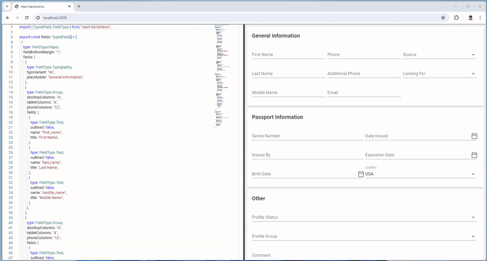
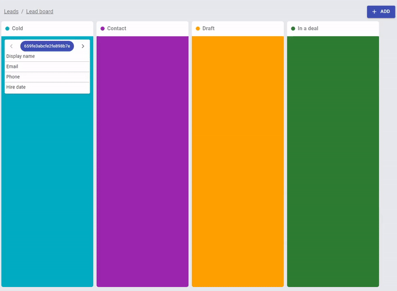
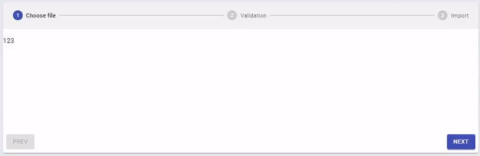
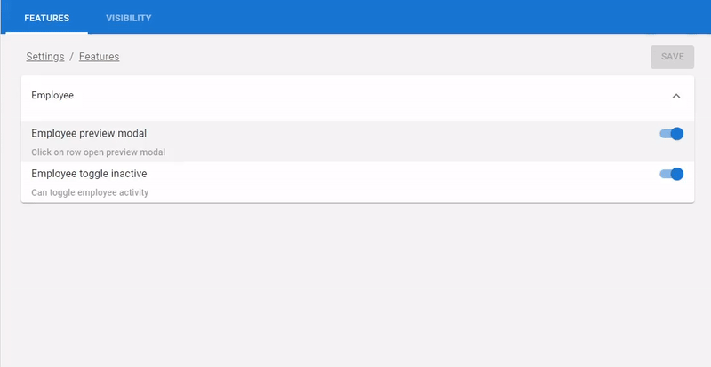

# ⚛️ react-declarative

> [MUI](https://mui.com/) json endpoint form builder. Check this [Storybook](https://github.com/react-declarative/react-declarative-storybook), the [Playground](https://react-declarative-playground.github.io/) and the [Docs Folder](./docs/Readme.md) for more samples. Also [Playwright End-to-End Testbed](https://github.com/react-declarative/react-declarative-e2e) available

[](https://npmjs.org/package/react-declarative)


A React view builder which interacts with a JSON endpoint to generate nested 12-column grids with input fields and automatic state management in a declarative style. Endpoint is typed by TypeScript guards (**IntelliSense** available). This tool is based on `MUI` components, so your application will look normal on any device...

**More than Forms:** can be used for build any UI like dashboards, CRM and ERP, mobile apps. Solving your problems.  *⭐Star* and *💻Fork* It will be appreciated

<!--

## Contents

1. [Short review](./README.md#short-review)
2. [Quick start](./README.md#quick-start)
3. [Installation](./README.md#installation)
4. [Demos](./README.md#demos)
5. [Declarative Scaffold component](./README.md#declarative-scaffold-component)
6. [Declarative KanbanView component](./README.md#declarative-kanbanview-component)
7. [Declarative WizardView component](./README.md#declarative-wizardview-component)
8. [VisibilityView and FeatureView components](./README.md#visibilityview-and-featureview-components)
9. [JSON-templated view engine](./README.md#json-templated-view-engine)
10. [JSON-templated grid engine](./README.md#json-templated-grid-engine)
11. [DOM Frames with infinite scroll and transparent-api virtualization](./README.md#dom-frames-with-infinite-scroll-and-transparent-api-virtualization)
12. [Async hooks and Action components](./README.md#async-hooks-and-action-components)
13. [Async pipe port](./README.md#async-pipe-port)
14. [Structural directive port](./README.md#structural-directive-port)
15. [Animated view transition](./README.md#animated-view-transition)
16. [Build-in router](./README.md#build-in-router)
17. [MapReduce Data Pipelines](./README.md#mapreduce-data-pipelines)
18. [Ref-managed MVVM collection](./README.md#ref-managed-mvvm-collection)
19. [See also](./README.md#see-also)
20. [Patterns inside](./README.md#patterns-inside)
21. [Philosophy notes](./README.md#philosophy-notes)
22. [License](./README.md#license)
23. [Thanks](./README.md#thanks)

-->

## Playground

> [!TIP]
> Try without installing directly [in your web browser](https://react-declarative-playground.github.io/)



Link to [the playground](https://react-declarative-playground.github.io/)

## Using with AI


There is a guide to make GPT-4 generate form schemas automatically. Check [the docs folder for guide](./docs/Readme.md#using-with-ai)


## Short review

> [!TIP]
> A few adjectives which can be applied to `react-declarative`

1. **Accesible**

Every callback you need: field or group of fields focus/blur event, form invalidity state, [data-testid](https://medium.com/@automationTest/why-your-development-team-should-use-data-testid-attributes-a83f1ca27ebb) and more

2. **Configurable**

Each field can be statically [hidden by settings dictionary](https://github.com/react-declarative/react-pocketbase-crm?tab=readme-ov-file#feature-model-and-dynamic-field-visibility) and dynamically by form state condition. Same if you want to disable or make field readonly

3. **Extendable**

It allow you to override any field type by slot context or [inject custom JSX](./demo/src/pages/GalleryPage.tsx#L206) directly into form without additional boilerplate. Also that lib can be used with all React ecosystem, for example, try with [Million.js](https://dev.to/tobysolutions/million-30-all-you-need-to-know-3d2), It makes `react-declarative` extreamly performant even on 2016 devices

4. **Maintainable**

Write code without going into [technical debt](https://en.wikipedia.org/wiki/Technical_debt). The big diffrence with [jsonforms](https://jsonforms.io/docs/#how-does-it-work) is you actually write less code cause you don't need `data schema`. In `react-declarative` all validations are build into `ui schema`, so backend endpoint can be changed partially if some properties are unused (see [PATCH method](https://developer.mozilla.org/en-US/docs/Web/HTTP/Methods/PATCH))

5. **Reflectable**

Each form schema can be [reflected](https://learn.microsoft.com/en-us/dotnet/api/system.reflection.typeinfo?view=net-8.0) by using `getAvailableFields` for additional inline validations, data cleanup if some fields are not required anymore, data export (generate [excel export](https://www.npmjs.com/package/xlsx) from current form). That extreamly hard to implement with `jsonforms`

6. **Reliable**

React 18 [Concurrent render](https://react.dev/blog/2022/03/29/react-v18#what-is-concurrent-react) used under the hood (state updates in async *useEffect*) so the `jsonforms` will slow down on 200+ fields form, `react-declarative` will not. Also [RPS](https://en.wikipedia.org/wiki/Web_server#requests_per_second) optimised by [debounce of form state change event](https://rxjs.dev/api/operators/debounce). That means you will need less hardware measures on a server side to implement autosubmit

7. **Code-Splittable**

JSON templates can be downloaded statically, builded dynamically, [lazy-loaded dynamically](https://webpack.js.org/concepts/module-federation/)

8. **Scalable**

Easy internationalization with translation dictionaries for Combobox field. [JSX Factory for labels translation](https://github.com/react-declarative/react-i18n-jsx-factory). An organisation for tutoring newbies [with 25 projects with AI](https://github.com/react-declarative/brainjs-cryptocurrency-trend), reactive programming and more 


## Quick start

> [!IMPORTANT]
> There is a `create-react-app` template available [in this repository](https://github.com/react-declarative/cra-template-react-declarative)

```bash
yarn create react-app --template cra-template-react-declarative .
```

or

```bash
npx create-react-app . --template=react-declarative
```


## Installation

> [!NOTE]
> There is a sample app avalible in the [demo](./demo/src/index.tsx) folder...

```bash
npm install --save react-declarative tss-react @mui/material @emotion/react @emotion/styled
```


## Migrate

> [!NOTE]
> A lightweight version with only `<One />` component and dependencies published in [react-declarative-lite](https://github.com/react-declarative/react-declarative-lite) package


## Demos

> [!NOTE]
> The `react-declarative` is not just a form builder. This one is the huge framework with dashboard adaptive cards builder, crud-based Grid component and more.<br> Check [the docs folder](./docs/Readme.md)

This tool also provide it's own way of rapid application development by simplifying app state managament. New features appear frequently, so you should be able to [read the project's storybook](https://github.com/react-declarative/react-declarative-storybook), browse [an organization with sample projects](https://github.com/react-declarative), and [read the source code](https://github.com/react-declarative/react-declarative)

Several starter kits available (Check [Playwright End-to-End testbed](https://github.com/react-declarative/react-declarative-e2e))

**1. Pure React Starter**

> [!NOTE]
> GitHub repo: [https://github.com/react-declarative/cra-template-react-declarative](https://github.com/react-declarative/cra-template-react-declarative)

```bash
yarn create react-app --template cra-template-react-declarative .
```

**2. Ethers.js/React Starter**

> [!NOTE]
> GitHub repo: [https://github.com/react-declarative/cra-template-solidity](https://github.com/react-declarative/cra-template-solidity)

```bash
yarn create react-app --template cra-template-solidity .
```

**3. AppWrite/React Starter**

> [!NOTE]
> GitHub repo: [https://github.com/react-declarative/cra-template-appwrite](https://github.com/react-declarative/cra-template-appwrite)

```bash
yarn create react-app --template cra-template-appwrite .
```

and few more quite interesting demo projects

**1. Playwright End-to-End Testbed**

> [!NOTE]
> GitHub repo: [https://github.com/react-declarative/react-declarative-e2e](https://github.com/react-declarative/react-declarative-e2e)

```bash
git clone https://github.com/react-declarative/react-declarative-e2e.git
```

**2. ERC-20 Payment gateway**

> [!NOTE]
> GitHub repo: [https://github.com/react-declarative/erc20-payment-gateway](https://github.com/react-declarative/erc20-payment-gateway)

```bash
git clone https://github.com/react-declarative/erc20-payment-gateway.git
```

**3. React Face KYC**

> [!NOTE]
> GitHub repo: [https://github.com/react-declarative/react-face-kyc](https://github.com/react-declarative/react-face-kyc)

```bash
git clone https://github.com/react-declarative/react-face-kyc.git
```

**4. BrainJS Cryptocurrency Trend**

> [!NOTE]
> GitHub repo: [https://github.com/react-declarative/brainjs-cryptocurrency-trend](https://github.com/react-declarative/brainjs-cryptocurrency-trend)

```bash
git clone https://github.com/react-declarative/brainjs-cryptocurrency-trend.git
```

**5. NFT Mint Tool**

> [!NOTE]
> GitHub repo: [https://github.com/react-declarative/nft-mint-tool](https://github.com/react-declarative/nft-mint-tool)

```bash
git clone https://github.com/react-declarative/nft-mint-tool.git
```

**6. React PocketBase CRM**

> [!NOTE]
> GitHub repo: [https://github.com/react-declarative/react-pocketbase-crm](https://github.com/react-declarative/react-pocketbase-crm)

```bash
git clone https://github.com/react-declarative/react-pocketbase-crm.git
```

**7. ChatGPT Ecommerce Grid**

> [!NOTE]
> GitHub repo: [https://github.com/react-declarative/chatgpt-ecommerce-prompt](https://github.com/react-declarative/chatgpt-ecommerce-prompt)

```bash
git clone https://github.com/react-declarative/chatgpt-ecommerce-prompt.git
```


## Declarative Scaffold component

> [!NOTE]
> Link to the [source code](./demo/src/App.Scaffold2.tsx)

The `<Scaffold2 />` implements the basic Material Design visual layout structure by using config instead of manual ui elements composition. 


```tsx
const options: IScaffold2Group[] = [
  {
    id: 'build',
    label: 'Build',
    children: [
      {
        id: 'authentication',
        label: 'Authentication',
        isVisible: async () => await ioc.authService.hasRole('unauthorized'),
        icon: PeopleIcon,
        tabs: [
          { id: 'tab1', label: 'Tab1 in header', },
          { id: 'tab2', label: 'Tab2 in header', },
        ],
        options: [
          { id: 'tab1', label: 'Tab1 in side menu' },
          { id: 'tab2', label: 'Tab2 in side menu' },
        ],
      },
      { id: 'Database', label: 'Label is optional (can be generated automatically from ID in snake case)', icon: DnsRoundedIcon, },
      { id: 'Storage', isDisabled: async () => await myAmazingGuard(), icon: PermMediaOutlinedIcon, },
      { id: 'Hosting', icon: PublicIcon, },

      ...

```


## Declarative KanbanView component

The `<KanbanView />` allow you to build [kanban](https://en.wikipedia.org/wiki/Kanban_(development)) boards with realtime support



```tsx

const rows: IBoardRow<ILeadRow>[] = [
  {
    label: "Display name",
    value: (id, employee) =>
      [employee.first_name, employee.last_name].join(" "),
  },
  {
    label: "Email",
    value: (id, employee) => employee.email,
    click: (id, data, payload) => payload.pickEmployeePreviewModal(id),
  },
  {
    label: "Phone",
    value: (id, employee) => employee.phone,
  },
  {
    label: "Hire date",
    value: (id, employee) => employee.hire_date,
  },
];

const columns: IBoardColumn<ILeadRow>[] = [
  {
    color: "#00ACC1",
    column: "cold",
    label: "Cold",
    rows,
  },
  {
    color: "#9C27B0",
    column: "contact",
    label: "Contact",
    rows,
  },
  {
    color: "#FFA000",
    column: "draft",
    label: "Draft",
    rows,
  },
  {
    color: "#2E7D32",
    column: "deal",
    label: "In a deal",
    rows,
  },
];

...

<KanbanView<ILeadRow>
  sx={{
    height: "calc(100vh - 145px)",
  }}
  onChangeColumn={handleChangeColumn}
  columns={columns}
  items={data}
/>
```


## Declarative WizardView component

The `<WizardView />` component allows you to build [action wizard](https://en.wikipedia.org/wiki/Wizard_(software)) with [stepper](https://mui.com/material-ui/react-stepper/) and nested routing



```tsx

const steps: IWizardStep[] = [
  {
    id: "select",
    label: "Choose file",
  },
  {
    id: "validate",
    label: "Validation",
  },
  {
    id: "import",
    label: "Import",
  },
];

const routes: IWizardOutlet[] = [
  {
    id: "select",
    element: SelectFileView,
    isActive: (pathname) => !!parseRouteUrl("/select-file", pathname),
  },
  {
    id: "validate",
    element: ValidateFileView,
    isActive: (pathname) => !!parseRouteUrl("/validate-file", pathname),
  },
  {
    id: "import",
    element: ImportFileView,
    isActive: (pathname) => !!parseRouteUrl("/import-file", pathname),
  },
];

...

<WizardView pathname="/select-file" steps={steps} routes={routes} />

...

const SelectFileView = ({
    history
}: IWizardOutletProps) => {
  return (
    <WizardContainer
      Navigation={
        <WizardNavigation
          hasNext
          onNext={() => history.replace("/validate-file")}
        />
      }
    >
        <p>123</p>
    </WizardContainer>
  );
};

```


## VisibilityView and FeatureView components

The `<VisibilityView />` and `<FeatureView />` components allows you to build configurable UI by using [reflection](https://en.wikipedia.org/wiki/Reflective_programming)



```tsx
const groups: IVisibilityGroup[] = [
  {
    name: "employee_visibility",
    /**
     * @type {IField[] | TypedField[]}
     * @description Same field type from `<One />` template engine
     */
    fields: employee_fields,
  },
];

...

<VisibilityView
  expandAll
  data={{ employee_visibility: data }}
  groups={groups}
  onChange={({ employee_visibility }) => onChange(employee_visibility)}
/>
```

By using [feature-oriented programming](https://en.wikipedia.org/wiki/Feature-oriented_domain_analysis) you can adjust view to different roles of users by partially hiding text, images and buttons

```tsx
const features: IFeatureGroup[] = [
  {
    title: "Employee",
    expanded: true,
    children: [
      {
        name: "employee_preview_modal",
        label: "Employee preview modal",
        description: "Click on row open preview modal",
      },
      {
        name: "employee_toggle_inactive",
        label: "Employee toggle inactive",
        description: "Can toggle employee activity",
      },
    ],
  },
];

...

<FeatureView
  expandAll
  data={data}
  features={features}
  onChange={onChange}
/>

...

<If
  payload={userId}
  condition={async (userId) => {
    return await ioc.permissionRequestService.getOwnerContactVisibilityByUserId(userId)
  }}
  Loading="Loading"
  Else="Hidden"
>
  {owner_contact}
</If>

```


## JSON-templated view engine

**1. Layout grid**

> [!NOTE]
> Link to the [source code](./demo/src/pages/LayoutPage.tsx)


```tsx
const fields: TypedField[] = [
  {
    type: FieldType.Line,
    title: 'User info',
  },
  {
    type: FieldType.Group,
    phoneColumns: '12',
    tabletColumns: '6',
    desktopColumns: '4',
    fields: [
      {
        type: FieldType.Text,
        title: 'First name',
        defaultValue: 'Petr',
        description: 'Your first name',
        leadingIcon: Face,
        focus() { console.log("focus :-)"); },
        blur() { console.log("blur :-("); },
        name: 'firstName',
      },
      {
        type: FieldType.Text,
        title: 'Last name',
        defaultValue: 'Tripolsky',
        description: 'Your last name',
        name: 'lastName',
      },

      ...

];
```

**2. Form validation**

> [!NOTE]
> Link to the [source code](./demo/src/pages/ValidationPage.tsx)


```tsx
const fields: TypedField[] = [
  {
    type: FieldType.Text,
    name: 'email',
    trailingIcon: Email,
    defaultValue: 'tripolskypetr@gmail.com',
    isInvalid({email}) {
      const expr = /^[\w-.]+@([\w-]+\.)+[\w-]{2,4}$/g;
      if (!expr.test(email)) {
        return 'Invalid email address';
      } else {
        return null;
      }
    },
    isDisabled({disabled}) {
      return disabled;
    },
    isVisible({visible}) {
      return visible;
    }
},
{
    type: FieldType.Expansion,
    title: 'Settings',
    description: 'Hide or disable',
    fields: [
      {
        type: FieldType.Switch,
        title: 'Mark as visible',
        name: 'visible',
        defaultValue: true,
      },

      ...

```

**3. Gallery of controls**

> [!NOTE]
> Link to the [source code](./demo/src/pages/GalleryPage.tsx)


```tsx
const fields: TypedField[] = [
  {
    type: FieldType.Paper,
    fields: [
      {
        type: FieldType.Line,
        title: 'Checkboxes',
      },
      {
        type: FieldType.Checkbox,
        name: 'checkbox1',
        columns: '3',
        title: 'Checkbox 1',
      },
      {
        type: FieldType.Checkbox,
        name: 'checkbox2',
        columns: '3',
        title: 'Checkbox 2',
      },

      ...

```

**4. JSX Injection**

> [!NOTE]
> Link to the [source code](./demo/src/pages/GalleryPage.tsx)

```tsx
const fields: TypedField[] = [
  {
    type: FieldType.Paper,
    fields: [
      {
        type: FieldType.Component,
        element: (props) => <Logger {...props}/>, 
      },
    ],
  },

  ...

];
```

**5. UI-Kit override**

> [!NOTE]
> Link to the [source code](./src/components/One/components/SlotFactory)

```tsx
<OneSlotFactory
  CheckBox={MyCheckBox}
  Text={MyInput}
  ...
>
  <One
    ...
  />
  ...
</OneSlotFactory>
```

**6. Hiding fields by business functions**

> [!NOTE]
> See [RBAC](https://en.wikipedia.org/wiki/Role-based_access_control)

```tsx
const fields: TypedField[] = [
  {
    type: FieldType.Text,
    name: 'phone',
    hidden: ({ payload }) => {
      return !payload.features.has('show-phone-number');
    },
  },

  ...

];
```


## JSON-templated grid engine

> [!NOTE]
> Link to the [source code](./demo/src/pages/ListPage.tsx)

Adaptive json-configurable data grid with build-in mobile device support


```tsx

const filters: TypedField[] = [
  {
    type: FieldType.Text,
    name: 'firstName',
    title: 'First name',
  },
  {
    type: FieldType.Text,
    name: 'lastName',
    title: 'Last name',
  }
];

const columns: IColumn[] = [
  {
    type: ColumnType.Text,
    field: 'id',
    headerName: 'ID',
    width: (fullWidth) => Math.max(fullWidth - 650, 200),
    columnMenu: [
      {
        action: 'test-action',
        label: 'Column action',
      },
    ],
  },
  ...
];

const actions: IListAction[] = [
  {
    type: ActionType.Add,
    label: 'Create item'
  },
  ...
];

const operations: IListOperation[] = [
  {
    action: 'operation-one',
    label: 'Operation one',
  },
];

const chips: IListChip[] = [
  {
    label: 'The chip1_enabled is true',
    name: 'chip1_enabled',
    color: '#4caf50',
  },
  ...
];

const rowActions: IListRowAction[] = [
  {
    label: 'chip1',
    action: 'chip1-action',
    isVisible: ({ chip1_enabled }) => chip1_enabled,
  },
  ...
];

...

return (
  <ListTyped
    withMobile
    withSearch
    withArrowPagination
    rowActions={rowActions}
    actions={actions}
    filters={filters}
    columns={columns}
    operations={operations}
    chips={chips}
  />
)

```


## DOM Frames with infinite scroll and `transparent-api virtualization`

> [!NOTE]
> You can use [InfiniteView](./src/components/InfiniteView/InfiniteView.tsx) for always-mounted or [VirtualView](./src/components/VirtualView/VirtualView.tsx) for virtualized infinite lists 


```tsx
<VirtualView
  component={Paper}
  sx={{
    width: "100%",
    height: 250,
    mb: 1,
  }}
  onDataRequest={() => {
    console.log('data-request');
    setItems((items) => [
      ...items,
      ...[uuid(), uuid(), uuid(), uuid(), uuid()],
    ]);
  }}
>
  {items.map((item) => (
    <span key={item}>{item}</span>
  ))}
</VirtualView>
```


## Async hooks and Action components

> [!NOTE]
> Hooks for fetching, caching and updating asynchronous data. Promise-based [command pattern](https://docs.devexpress.com/WPF/17353/mvvm-framework/commands/delegate-commands) ui components. The hooks will help you to avoid [multiple POST method execution](https://en.wikipedia.org/wiki/REST) when user missclick button. The components will show load indicator while `onClick` promise is pending

The `useAsyncProgress` will manage percent range of execution (`0% - 100%` for `<LinearProgress />` value)

```tsx
const { execute } = useAsyncProgress(
  async ({ data }) => {
    await createContact(data);
  },
  {
    onProgress: (percent) => {
      setProgress(percent);
    },
    onError: (errors) => {
      setErrors(errors);
    },
    onEnd: (isOk) => {
      history.replace("/report");
    },
  }
);

...

<ActionButton
  onClick={async () => {
    const file = await chooseFile(
      "application/vnd.openxmlformats-officedocument.spreadsheetml.sheet"
    );
    if (file) {
      const rows = await parseExcelContacts(file);
      execute(
        rows.map((row, idx) => ({
          data: row,
          label: `Row №${idx + 2}`,
        }))
      );
    }
  }}
>
  Choose XLSX
</ActionButton>
```

The `useSinglerunAction` will not execute any additional calls while original promise is pending

```tsx
const { execute } = useSinglerunAction(
  async () => {
   const file = await chooseFile("image/jpeg, image/png");
    if (file) {
      const filePath = await ioc.appwriteService.uploadFile(file);
      onChange(filePath);
    }
  }
);

...

<ActionIcon onClick={execute}>
  <CloudUploadIcon />
</ActionIcon>
```

The `useQueuedAction` will queue all promise fulfillment in functions execution order. Quite useful while [state reducer pattern](https://en.wikipedia.org/wiki/Redux_(JavaScript_library)) when coding [realtime](https://en.wikipedia.org/wiki/WebSocket).

```tsx
const { execute } = useQueuedAction(
  async ({ type, payload }) => {
    if (type === "create-action") {
      ...
    }
    if (type === "update-action") {

    }
    if (type === "remove-action") {
      ...
    }
  },
  {
    onLoadStart: () => ioc.layoutService.setAppbarLoader(true),
    onLoadEnd: () => ioc.layoutService.setAppbarLoader(false),
  }
);

...

useEffect(() => ioc.kanbanService.createSubject.subscribe(execute), []);

useEffect(() => ioc.kanbanService.updateSubject.subscribe(execute), []);

useEffect(() => ioc.kanbanService.removeSubject.subscribe(execute), []);

```

The `usePreventAction` will prevent any other action execution [while single one is pending](https://en.wikipedia.org/wiki/Semaphore_(programming))

```tsx
const {
  handleLoadStart,
  handleLoadEnd,
  loading,
} = usePreventAction();

...

<ActionButton
  disabled={loading}
  onLoadStart={handleLoadStart}
  onLoadEnd={handleLoadEnd}
>
  Action 1
</ActionButton>

...

<ActionButton
  disabled={loading}
  onLoadStart={handleLoadStart}
  onLoadEnd={handleLoadEnd}
>
  Action 2
</ActionButton>
```

The `usePreventNavigate` will [prevent navigate](https://medium.com/@goldhand/routing-design-patterns-fed766ad35fa) while action is running

```tsx
const { handleLoadStart, handleLoadEnd } = usePreventNavigate({
  history: ioc.routerService,
});

...

<ActionButton
  onLoadStart={handleLoadStart}
  onLoadEnd={handleLoadEnd}
>
  Action
</ActionButton>
```

The `useAsyncValue` will help you to manage [react-hooks/rules-of-hooks](https://www.npmjs.com/package/eslint-plugin-react-hooks) while working with remote data

```tsx
const [data, { loading, error }, setData] = useAsyncValue(async () => {
  return await getData();
});

if (loading || error) {
  return null;
}

return (
  <pre>
    {JSON.stringify(data, null, 2)}
  </pre>
)

...

const handleChangeData = async () => {
  const newData = await fetchApi('/api/v1/data', {
    method: "POST",
    ...
  })
  setData(newData)
}

```


## Async pipe port

> [!NOTE]
> See [angular2 docs](https://angular.io/api/common/AsyncPipe)

```tsx
import { Async } from 'react-declarative'

import { CircularProgress } from '@mui/material'

const PostItem = ({
  id,
}) => {

  const { getPostById } = useBlogApi();

  return (
    <Async payload={id} Loader={CircularProgress}>
      {async (id) => {
        const { title, body } = await getPostById(id);
        return (
          <div>
            <p>{title}</p>
            <p>{body}</p>
          </div>
        );
      }}
    </Async>
  );
};
```


## Structural directive port

> [!NOTE]
> See [angular2 docs](https://angular.io/guide/structural-directives)

```tsx
import { If } from 'react-declarative'

const ProfilePage = () => {
  const { hasRole } = useRoleApi();
  return (
    <If condition={() => hasRole("admin")}>
      <button>The admin's button</button>
    </If>
  );
};
```


## Animated view transition

> [!NOTE]
> Link to the [source code](./demo/src/pages/RevealPage.tsx)

```tsx
import { FetchView } from 'react-declarative'

const PostList = () => {

  const { getPosts } = useBlogApi();

  const state = [
    getPosts,
  ];

  return (
    <FetchView state={state} animation="fadeIn">
      {(posts) => (
        <div>
          {posts.map((post, idx) => (
            <p key={idx}>
              <b>{post.title}</b>
              {post.body}
            </p>
          ))}
        </div>
      )}
    </FetchView>
  );
};
```


## Build-in router

> [!NOTE]
> Link to the [source code](./demo/src/App.tsx)

```tsx
import { Switch } from 'react-declarative';

...

const routes = [
  {
    path: '/mint-page',
    guard: async () => await ioc.roleService.has('whitelist'),
    prefetch: async () => await ioc.ethersService.init(),
    unload: async () => await ioc.ethersService.dispose(),
    redirect: () => {
      let isOk = true;
      isOk = isOk && ioc.ethersService.isMetamaskAvailable;
      isOk = isOk && ioc.ethersService.isProviderConnected;
      isOk = isOk && ioc.ethersService.isAccountEnabled;
      if (isOk) {
        return "/connect-page";
      }
      return null;
    },
  },
];

...

const App = () => (
  <Switch history={history} items={routes} />
);
```


## MapReduce Data Pipelines

> [!NOTE]
> Link to the [source code](https://github.com/react-declarative/react-face-kyc/blob/master/src/hooks/useFaceWasm/emitters.ts)

```tsx
import { Source } from 'react-declarative';

...

const verifyCompleteEmitter = Source.multicast(() =>
  Source
    .join([
      captureStateEmitter,
      Source.fromInterval(1_000),
    ])
    .reduce((acm, [{ state: isValid }]) => {
      if (isValid) {
        return acm + 1;
      }
      return 0;
    }, 0)
    .tap((ticker) => {
      if (ticker === 1) {
        mediaRecorderInstance.beginCapture();
      }
    })
    .filter((ticker) => ticker === CC_SECONDS_TO_VERIFY)
    .tap(() => {
      mediaRecorderInstance.endCapture();
    })
);
```


## Ref-managed MVVM collection

> Link to the [source code](./demo/src/pages/MvvmPage.tsx)

```tsx
import { useCollection } from "react-declarative";

...

const collection = useCollection({
  onChange: (collection, target) => console.log({
    collection,
    target,
  }),
  initialValue: [],
});

const handleAdd = async () => {
  const { id, ...data } = await fetchApi("/api/v1/counters/create", {
    method: "POST",
  });
  collection.push({
    id,
    ...data,
  });
};

const handleUpsert = async () => {
  const updatedItems = await fetchApi("/api/v1/counters/list");
  collection.upsert(updatedItems);
};

return (
  <>
    <button onClick={handleAdd}>Add item</button>
    <button onClick={handleUpsert}>Upsert items</button>
    <ul>
      {collection.map((entity) => (
        <ListItem key={entity.id} entity={entity} />
      ))}
    </ul>
  </>
);
```


## See also

```tsx
import { ConstraintView } from 'react-declarative';
import { DragDropView } from 'react-declarative';
import { ScrollView } from 'react-declarative';
import { ScaleView } from 'react-declarative';
import { FadeView } from 'react-declarative';
import { TabsView } from 'react-declarative';
import { WaitView } from 'react-declarative';
import { PingView } from 'react-declarative';
import { OfflineView } from 'react-declarative';
import { RevealView } from 'react-declarative';
import { SecretView } from 'react-declarative';
import { PortalView } from 'react-declarative';
import { RecordView } from 'react-declarative';
import { CardView } from 'react-declarative';
import { ErrorView } from 'react-declarative';
import { AuthView } from 'react-declarative';
import { InfiniteView } from 'react-declarative';
import { VirtualView } from 'react-declarative';
```


## Patterns inside

1. [MVVM](https://backbonejs.org/#Collection) - `useCollection`, `useModel`
2. [DI](https://angular.io/guide/dependency-injection) - `provide`, `inject`, `createServiceManager`
3. [Builder](https://learn.microsoft.com/en-us/dotnet/api/system.text.stringbuilder?view=net-7.0) - `useListEditor`, `useMediaStreamBuilder`
4. [Adapter](https://en.wikipedia.org/wiki/Adapter_pattern) - `normalizeText`
5. [Observer](https://en.wikipedia.org/wiki/Observer_pattern) - `useChangeSubject`, `useSubject`, `useRenderWaiter`, `Subject`, `BehaviorSubject`, `EventEmitter`, `fromPromise`
6. [Command](https://en.wikipedia.org/wiki/Command_pattern) - `ActionTrigger`, `ActionFilter`, `ActionButton`, `ActionToggle`, `ActionMenu`, `ActionIcon`, `ActionModal`, `InfiniteView`, `VirtualView`, `useActionModal`
7. [Coroutine](https://en.wikipedia.org/wiki/Coroutine) - `FetchView`, `WaitView`, `PingView`, `Async`, `If`, `useAsyncAction`
8. [Routing](https://medium.com/@goldhand/routing-design-patterns-fed766ad35fa) - `Switch`, `OutletView`, `getRouteParams`, `getRouteItem`, `useRouteParams`, `useRouteItem`, `createRouteItemManager`, `createRouteParamsManager`
9. [Monad](https://en.wikipedia.org/wiki/Monad_(functional_programming)) - `singleshot`, `cancelable`, `queued`, `cached`, `debounce`, `compose`, `trycatch`, `memoize`, `ttl`, `lock`
10. [Composition](https://reactjs.org/docs/composition-vs-inheritance.html) - `VirtualView`, `InfiniteView`, `PortalView`, `RevealView`, `PingView`, `WaitView`, `FadeView`, `ScaleView`, `ScrollView`, `ModalManager`
11. [HoC](https://reactjs.org/docs/higher-order-components.html) - `ConstraintView`, `AutoSizer`, `FetchView`, `Async`, `If`
12. [Facade](https://en.wikipedia.org/wiki/Facade_pattern) - `Subject`, `Observer`
13. [Scheduled-task](https://en.wikipedia.org/wiki/Scheduled-task_pattern) - `Task`, `singlerun`
14. [RAD](https://en.wikipedia.org/wiki/Rapid_application_development) - `RecordView`, `CardView`
15. [Functional](https://en.wikipedia.org/wiki/Functional_programming) - `useActualValue`, `useActualCallback`, `useActualState`, `useSearchParams`, `useSearchState`, `useChange`
16. [Declarative](https://en.wikipedia.org/wiki/Declarative_programming) - `One`, `List`, `Scaffold`, `Scaffold2`, `RecordView`, `CardView`
17. [Reactive](https://en.wikipedia.org/wiki/ReactiveX) - `EventEmitter`, `Subject`, `BehaviorSubject`, `Observer`
18. [Lambda Architecture](https://en.wikipedia.org/wiki/Lambda_architecture) - `Source`, `Operator`, `useSource`, `useSubscription`
19. [Aspect Oriented](https://en.wikipedia.org/wiki/Aspect-oriented_programming) - `serviceManager`, `Source`
20. [Reflection](https://learn.microsoft.com/en-us/dotnet/framework/reflection-and-codedom/reflection) - `getAvailableFields`, `VisibilityView`
21. [Pagination](https://medium.com/@oshiryaeva/offset-vs-cursor-based-pagination-which-is-the-right-choice-for-your-project-e46f65db062f) - `useOffsetPaginator`, `useCursorPaginator`
22. [Feature model](https://en.wikipedia.org/wiki/Feature_model) - `useFeatureView`, `useVisibilityView`, `FeatureView`, `VisibilityView`
23. [Software Fault Prevention](https://en.wikipedia.org/wiki/Software_fault_tolerance) - `ErrorBoundary`, `ErrorView`


## Philosophy notes

1. [React: declarative vs imperative](./NOTES.md#react-declarative-vs-imperative)

    Declarative programming is when a more qualified specialist writing code in a way when its behavior can be changed by using external config which represent oriented graph of objects

2. [Fractal pattern](./NOTES.md#fractal-pattern-fractal-project-structure)

    Fractal pattern conveys that similar patterns recur progressively and the same thought process is applied to the structuring of codebase i.e All units repeat themselves.

3. [SOLID in react-declarative](./NOTES.md#solid-in-react-declarative)

    SOLID principles described by simple words with examples in a source code

4. [Product-oriented principles](./NOTES.md#product-oriented-principles)

    These principles will help you to keep the code as clean as possible when you need to make a MVP immediately

5. [Oriented graphs: reduce algoritm difficulty](./NOTES.md#reduce-algoritm-difficulty-when-working-with-oriented-graphs)

    The real useful note for working with oriented graphs

6. [Using underected data flow for building software product line](./NOTES.md#using-underected-data-flow-for-building-software-product-line)

    Useful snippets to split procedure code with the inversion of control pattern

7. [Frontend as a service bus for Service-Oriented Architecture (SOA)](./NOTES.md#frontend-as-a-service-bus-for-service-oriented-architecture-soa)

    Serverless compution pros and no cons with react-declarative

8. [Make SPA Java again](./NOTES.md#make-spa-java-again)

    The problem of clean architecture in modern React apps


## License

> P.S. Got a question? Feel free to [write It in issues](https://github.com/react-declarative/react-declarative/issues), I need traffic

MIT [@tripolskypetr](https://github.com/tripolskypetr)

## External References

1. [Playground](https://react-declarative-playground.github.io/)
2. [Storybook](https://react-declarative.github.io/)
3. [Typedoc](https://react-declarative-typedoc.github.io/)

## Thanks

Dude, you reached that point, omg. Could you 
[Star it on GitHub](https://github.com/react-declarative/react-declarative) plz)
