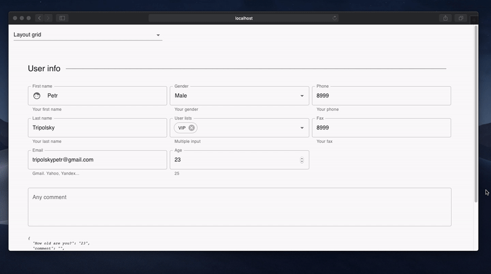
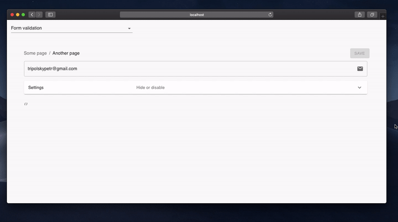
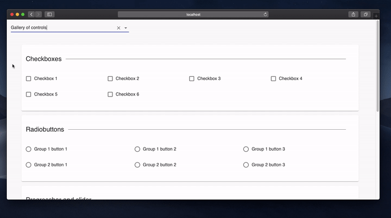

# react-view-builder

> [Material-ui](https://material-ui.com/) json endpoint form builder. Check [this site](https://theonekit.com/) for more samples...

An React form builder which interfaces with a json endpoint to generate 12 column based nested grids with input fields and automatic state management. Json endpoint is typed by typescript (**IntelliSense** available). This tool is based on `material-ui` components so your app is going to look pretty on any device...

## Install

> There is a sample app avalible in [example](./example/src/index.tsx) folder...

```bash
npm install --save @tripolskypetr/react-view-builder
```

## Demos

### 1. Layout grid

> Link to [source code](./example/src/pages/LayoutPage.tsx)



```tsx
const fields: TypedField[] = [
  {
    type: FieldType.Line,
    title: 'User info',
  },
  {
    type: FieldType.Group,
    phoneColumns: '12',
    tabletColumns: '6',
    desktopColumns: '4',
    fields: [
      {
        type: FieldType.Text,
        title: 'First name',
        defaultValue: 'Petr',
        description: 'Your first name',
        leadingIcon: Face,
        focus() { console.log("focus :-)"); },
        blur() { console.log("blur :-("); },
        name: 'firstName',
      },
      {
        type: FieldType.Text,
        title: 'Last name',
        defaultValue: 'Tripolsky',
        description: 'Your last name',
        name: 'lastName',
      },

      ...

];
```

### 2. Form validation

> Link to [source code](./example/src/pages/ValidationPage.tsx)



```tsx
const fields: TypedField[] = [
  {
    type: FieldType.Text,
    name: 'email',
    trailingIcon: Email,
    defaultValue: 'tripolskypetr@gmail.com',
    isInvalid({email}) {
      const expr = /^[\w-.]+@([\w-]+\.)+[\w-]{2,4}$/g;
      if (!expr.test(email)) {
        return 'Invalid email address';
      } else {
        return null;
      }
    },
    isDisabled({disabled}) {
      return disabled;
    },
    isVisible({visible}) {
      return visible;
    }
},
{
    type: FieldType.Expansion,
    title: 'Settings',
    description: 'Hide or disable',
    fields: [
      {
        type: FieldType.Switch,
        title: 'Mark as visible',
        name: 'visible',
        defaultValue: true,
      },

      ...

```

### 3. Gallery of controls

> Link to [source code](./example/src/pages/GalleryPage.tsx)



```tsx
const fields: TypedField[] = [
  {
    type: FieldType.Paper,
    fields: [
      {
        type: FieldType.Line,
        title: 'Checkboxes',
      },
      {
        type: FieldType.Checkbox,
        name: 'checkbox1',
        columns: '3',
        title: 'Checkbox 1',
      },
      {
        type: FieldType.Checkbox,
        name: 'checkbox2',
        columns: '3',
        title: 'Checkbox 2',
      },

      ...

```

## License

MIT © [tripolskypetr](https://github.com/tripolskypetr)
