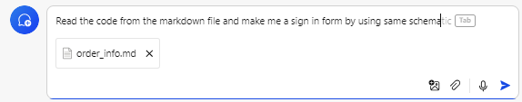

# One Component

> `<One />` is a component of the `react-declarative` library, representing a form with various fields (text, images, rating, etc.) and a css-grid layout. This allows for convenient storage, creation, and modification of data, such as a user's profile.

## Playground

Try without installing directly [in your web browser](https://react-declarative-playground.github.io/)


## Using with AI

The `react-declarative` framework contains several sample projects and examples created especially for AI code generation. The problem of AI is that the context window cannot load all [project abstraction layers](https://medium.com/expedia-group-tech/onion-architecture-deed8a554423) at once, so when generating code we have to manually change the prompt based on the current abstraction level.

That means AI cannot debug the hooks when changing JSX. The declarative view engine does state management (lower abstraction level) automatically under the hood so It the best for AI

**The samples for AI**

1. [Order info](./sample/order_info.md)
2. [Typography](./sample/typography.md)
3. [Settings page](./sample/settings_page.md)
4. [Product Shape](./sample/product_shape.md)
5. [Profile card](./sample/profile_card.md)
6. [Gallery of controls](./sample/gallery_of_controls.md)
7. [Variant form](./sample/variant_form.md)
8. [Custom JSX](./sample/custom_jsx.md)
9. [Machine learning](./sample/machine_learning.md)
10. [Dashboard](./sample/dashboard.md)
11. [Adaptive form](./sample/adaptive_form.md)
12. [Account info](./sample/)

**The prompt**

Open [https://www.bing.com/chat](https://www.bing.com/chat) and select one of these samples. Use the next prompt. Check the code with [the playground](https://react-declarative-playground.github.io/)

```html
Read the code from the markdown file and make me a sign in form by using same schema
```



## Articles:

1. [The code as the side effect](./other/code-sideeffect.md)
2. [React components for undirected data flow](./other/react-components-for-data-flow.md)
3. [MobX onion architecture](./other/onion-architecture-mobx.md)
4. [DataGrid software design to reduce app cost](./other/datagrid-software-design.md)
5. [Writing custom UIKit in parallel with the development of the main product](./other/how-to-implement-uikit.md)

## Source Description:

**Main concept**

1. [OneInternal](./code/OneInternal.md)
2. [OneGenesis](./code/OneGenesis.md)
3. [One](./code/One.md)
4. [useResolved](./code/useResolved.md)
5. [StateProvider](./code/StateProvider.md)
6. [PayloadProvider](./code/PayloadProvider.md)
7. [OneContextProvider](./code/OneContextProvider.md)
8. [IManaged](./code/IManaged.md)
9. [makeField](./code/makeField.md)
10. [TypedField](./code/TypedField.md)
11. [SlotFactory](./code/SlotFactory.md)
12. [Form schema](./code/Schema.md)
13. [Routing](./code/Routing.md)
14. [Route Outlets](./code/OutletView.md)
15. [Dependency Injection](./code/DI.md)

**Additional functionality**

1. [Components](./code/Components.md)
2. [Hooks](./code/Hooks.md)
3. [Higher Order Function](./code/HOF.md)
4. [Mathematical Logic](./code/MATH.md)
5. [Reactive Programming](./code/RX.md)
6. [Utility Functions](./code/UTILS.md)
7. [Data Handling Guidelines](./code/API.md)

**Other**

1. [react-declarative.d.ts](./code/react-declarative.md)

## Field properties with JSDoc:

**With slots:**

1. [CheckBox](/src/components/One/components/SlotFactory/components/CheckBox.tsx)
2. [Choose](/src/components/One/components/SlotFactory/components/Choose.tsx)
3. [Combo](/src/components/One/components/SlotFactory/components/Combo.tsx)
4. [Complete](/src/components/One/components/SlotFactory/components/Complete.tsx)
5. [Date](/src/components/One/components/SlotFactory/components/Date.tsx)
6. [Dict](/src/components/One/components/SlotFactory/components/Dict.tsx)
7. [File](/src/components/One/components/SlotFactory/components/File.tsx)
8. [Items](/src/components/One/components/SlotFactory/components/Items.tsx)
9. [Line](/src/components/One/components/SlotFactory/components/Line.tsx)
10. [Progress](/src/components/One/components/SlotFactory/components/Progress.tsx)
11. [Radio](/src/components/One/components/SlotFactory/components/Radio.tsx)
12. [Rating](/src/components/One/components/SlotFactory/components/Rating.tsx)
13. [Slider](/src/components/One/components/SlotFactory/components/Slider.tsx)
14. [Switch](/src/components/One/components/SlotFactory/components/Switch.tsx)
15. [Text](/src/components/One/components/SlotFactory/components/Text.tsx)
16. [Time](/src/components/One/components/SlotFactory/components/Time.tsx)
17. [Tree](/src/components/One/components/SlotFactory/components/Tree.tsx)
18. [Typography](/src/components/One/components/SlotFactory/components/Typography.tsx)
19. [YesNo](/src/components/One/components/SlotFactory/components/YesNo.tsx)

**Without slots:**

1. [Component](/src/components/One/fields/ComponentField.tsx)
2. [Init](/src/components/One/fields/InitField.tsx)
3. [Phony](/src/model/IPhonyField.ts)
4. [Line](/src/components/One/fields/Line.tsx)

## Layout properties with JSDoc:

1. [Box](/src/components/One/layouts/BoxLayout.tsx)
2. [Center](/src/components/One/layouts/CenterLayout.tsx)
3. [Condition](/src/components/One/layouts/ConditionLayout.tsx)
4. [Custom](/src/components/One/layouts/CustomLayout.tsx)
5. [Div](/src/components/One/layouts/DivLayout.tsx)
6. [Expansion](/src/components/One/layouts/ExpansionLayout.tsx)
7. [Fragment](/src/components/One/layouts/FragmentLayout.tsx)
8. [Group](/src/components/One/layouts/GroupLayout.tsx)
9. [Hero](/src/components/One/layouts/HeroLayout.tsx)
10. [Outline](/src/components/One/layouts/OutlineLayout.tsx)
11. [Paper](/src/components/One/layouts/PaperLayout.tsx)
12. [Stretch](/src/components/One/layouts/StretchLayout.tsx)
13. [Tabs](/src/components/One/layouts/TabsLayout.tsx)

## Documentation

**Code guide**

1. [Implement your own field](../src/README.md)

**Software design**

1. [API reference](./auto/index.md)
2. [Release notes](../CHANGELOG.md)
3. [Philosophy notes](../NOTES.md)
4. [FAQ](../FAQ.md)

## Overview

The goal is to create a unified React component for settings-like forms. The component manages form state, handles validation, and streamlines the development process by reducing boilerplate code.

## Key Features 

1. **Field Configuration** : Fields are configured using an array of objects implementing the `IField` interface, defining the field type, structure, and other properties.

> Link to [the demo](https://jsfiddle.net/tripolskypetr/0pywxmsk/)

```tsx
<One
  fields={[
    {
      type: FieldType.Items,
      title: 'A sample field',
      placeholder: 'Multiple selection',
      name: 'items',
      itemList: ['a', 'b', 'c'],
      isVisible: (obj) => obj.visible,
      isDisabled: (obj) => obj.disabled,
    },
    {
      type: FieldType.Checkbox,
      title: 'Mark as visible',
      defaultValue: true,
      name: 'visible',
    },
    {
      type: FieldType.Checkbox,
      title: 'Mark as disabled',
      defaultValue: false,
      name: 'disabled',
    },
  ]}
/>
```

 
2. **Automatic State Management** : The component automatically manages form state based on three criteria - field name, a handler function for fetching data, and an `onChange` callback.

> Link to [the demo](https://jsfiddle.net/tripolskypetr/erw7gcxq/)

```tsx
const handler = () => Promise.resolve({ key: 'value' }) // or simply handler = { key: 'value' }
<One
  fields={[
    {
      type: FieldType.Checkbox,
      title: 'Tomato',
      defaultValue: true,
      name: 'isTomatoChecked',
    },
    {
      type: FieldType.Checkbox,
      title: 'Cheese',
      name: 'isCheeseChecked',
    },
  ]}
  handler={handler}
  fallback={fallback}
  onChange={change}
  LoadPlaceholder={SpinerComponent}
/>
```

3. **Responsive Layout** : The component supports a responsive layout with columns specified for different screen sizes.

> Link to [the demo](https://jsfiddle.net/tripolskypetr/w3mr4akv/)

```tsx
<One fields={[
  {
    type: FieldType.Group,
    phoneColumns: '12',
    columns: '6',
    fields: [
      //...
    ],
  },
  {
    type: FieldType.Group,
    phoneColumns: '12',
    columns: '6',
    fields: [
      //...
    ],
  },
]} />
```

4. **Field Customization** : Fields can be customized with options such as visibility, disabled state, and invalidity.

> Link to [the demo](https://jsfiddle.net/tripolskypetr/0pywxmsk/)

```tsx
<One
  fields={[
    {
      type: FieldType.Items,
      title: 'A sample field',
      placeholder: 'Multiple selection',
      name: 'items',
      itemList: ['a', 'b', 'c'],
      isVisible: (obj) => obj.visible,
      isDisabled: (obj) => obj.disabled,
    },
    //...
  ]}
/>
```

5. **Additional Features** : The component supports computed fields, event handling for icons, and options for disabling the "Save" button based on form validation.

> Link to [the demo](https://jsfiddle.net/tripolskypetr/67m3aoc1/)

```tsx
<One
  fields={[
    {
      type: FieldType.Progress,
      showPercentLabel: true,
      name: 'slider',
    },
    {
      type: FieldType.Slider,
      name: 'slider',
      leadingIcon: VolumeDown,
      trailingIcon: VolumeUp,
      defaultValue: 30,
      leadingIconClick(v, change) { change(v - 10) },
      trailingIconClick(v, change) { change(v + 10) },
    },
    //...
  ]}
/>
```

## Benefits 
- **Code Reusability** : Reduces duplication by creating a unified component for form handling. 

- **Simplified Configuration** : Abstracts away complex form configurations into a simple and customizable interface. 

- **Responsive Design** : Easily adapts to different screen sizes with responsive layout options. 

- **Improved Developer Experience** : Streamlines development with automatic state management and customizable field behaviors.

This One form component aims to enhance code maintainability, readability, and efficiency in developing settings-like forms.

## Usage

There are four main props which you need to pay attention to.

### 1. fields

This is the primary aspect to work with. Here, you list the fields that should be in the form. It is defined through the `fields` variable (an array) with the type `TypedField[]`.

```tsx
const fields: TypedField[] = [
{
    type: FieldType.Group,
    fields: [
      {
        type: FieldType.Rating,
        columns: "2",
        phoneColumns: '12',
        fieldBottomMargin: "0",
        name: "rating",
        defaultValue: 3
      },
      {
        type: FieldType.Group,
        columns: "10",
        phoneColumns: '12',
        fields: [
          {
            name: 'lastName',
            type: FieldType.Text,
            title: 'Last name',
            description: 'Required',
          },
          {
            type: FieldType.Combo,
            title: "Gender",
            placeholder: "Choose your gender",
            name: "gender",
            itemList: [
              "Male",
              "Female",
            ]
          },
        ]
      }   
    ]  
}] 

export const examplePage = () => (
  <One
    fields={fields}
  /> 
);
```

The main props include:

`type` - specifies the field type, for example, `type: FieldType.Group`. There are a total of 22 field types.

`columns` - used for layout, with a string value from 1 to 12, where 12 represents the full width (following grid logic).

`desktopColumns`, `tabletColumns`, and `phoneColumns` - used to configure the layout on desktop, tablet, and smartphone, respectively.

Each field type has its own properties such as `name`, `title`, `fieldBottomMargin`, `outlined`, `defaultValue`, etc.

To insert a separate component into `fields`, use `type: FieldType.Component`, where the desired component is specified in the `element` property. For example:

```tsx
{
    type: FieldType.Component,
    element: () => (
        <div> Example </div>
    ),
}
```

### 2. handler

It should be a function (can return a promise) or a reference for fetching the component's state. It is used to connect the component to the server or mock data. Through variable context composition, you can reach the `id` from the route.

### 3. fallback

A callback in case of an error in `handler`.

### 4. onChange

A function triggered when data in the `<One/>` form changes. For example, when the user's name changes.

## How do `columns` work in the layout?

> `columns` are responsible for the layout and work on a grid logic. They determine the width each element occupies. The maximum value is '12' (as `columns` is of type `string`), representing the full width. The value "6" would mean half the width, "4" is 1/3 width, "3" is 1/4, and so on. Note: the width refers to the parent's width. The default value is "12".

For example:

```tsx
{
    type: FieldType.Group,
    fields: [
      {
        type: FieldType.Rating,
        columns: "2",
        desktopColumns: '2',
        tabletColumns: '2',
        phoneColumns: '12',
        fieldBottomMargin: "0",
        fieldBottomMargin: "0",
        name: "rating",
        defaultValue: 3
      },
      {
        type: FieldType.Group,
        columns: "10",
        desktopColumns: '10',
        tabletColumns: '10',
        phoneColumns: '12',
        fields: [
          {
            name: 'name',
            type: FieldType.Text,
            title: 'Name',
          }
        ]
      }
    ]
}
```

In this example, the Rating element will occupy 20% of the width, and the second Group element will occupy 80% of the width.

`desktopColumns` used for desktop layout;

`tabletColumns` used for tablet layout;

`phoneColumns` used for smartphone layout;

You can adjust the bottom and right margin using `fieldBottomMargin` and `fieldRightMargin`, respectively.
