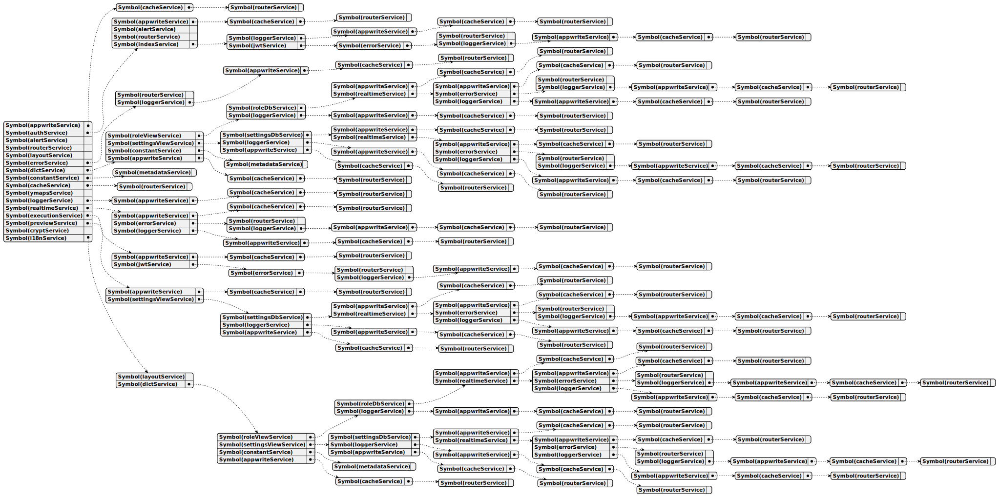

# Dependency Injection

The `react-declarative` library includes `provide` and `inject` functions which are part of a dependency injection framework. They are used to manage dependencies between different parts of the application, allowing for better decoupling and easier testing.

`provide`: This function is used to register dependencies within the dependency injection container. It takes a key (often a symbol) and a factory function as arguments. The factory function is responsible for creating instances of the dependency when needed. In the `config.ts` file, you can see that provide is used to register instances of `AlertService` and `PocketbaseService` with corresponding symbols (TYPES.alertService and TYPES.pocketbaseService).

`inject`: This function is used to retrieve dependencies from the container. It takes a key (or symbol) representing the dependency and returns the instance of that dependency. In the `ioc.ts` file, you can see that inject is used to retrieve instances of `AlertService` and `PocketbaseService` using the symbols registered with provide.

These functions facilitate the inversion of control principle, where the control of creating and managing dependencies is shifted from the components themselves to an external container. This leads to more modular and maintainable code, as components become less coupled to each other and can be easily replaced or extended without affecting the rest of the application.

## Functionality

There are more utility functions provided which are shared from `serviceManager` object exported from `react-declarative`. The most important are

1. `registerInstance` - Registers a singleton instance with the service manager.

2. `registerCreator` - Registers a factory function for a given key.

3. `inject` - Injects a dependency using the given key and returns an instance of the dependency.

4. `waitForProvide` - Wait for provide of lazy loaded services

5. `prefetch` - Prefetches data using `prefetch` method of each service

6. `unload` - Unloads a resources using `unload` method of each service

7. `clear` - Dispose the service list

8. `toUML` - Converts a resolution tree to a [YAML UML representation](https://en.wikipedia.org/wiki/Applications_of_UML).

## Visualization

That SVG schema can be easy generated by using the next tools

1. [https://www.planttext.com/](https://www.planttext.com/)

2. [https://www.plantuml.com/plantuml/uml/](https://www.plantuml.com/plantuml/uml/)

3. [https://plantuml.github.io/plantuml-core/raw.html](https://plantuml.github.io/plantuml-core/raw.html)

4. [https://github.com/plantuml](https://github.com/plantuml)
