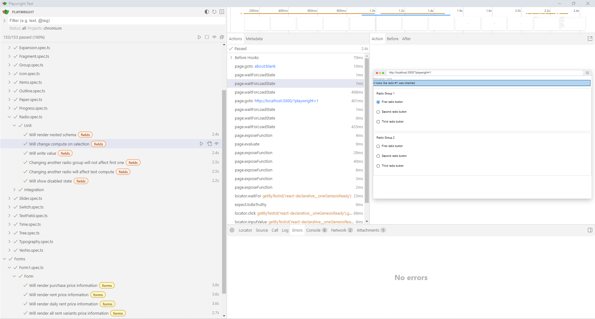

# Writing custom UI Kit in parallel with the development of the main product

> The point of `react-declarative` is to start the development process ASAP, polish the design later. Here's how to develop the main product and the UI kit in parallel



## Main concept

By default, when you coding with `react-declarative`, you are using MUI. It looks and feels native on each operation system: `Windows`, `Linux`, `macOS`, `ChromeOS`, `iOS`, `Android` even `Tesla Car Firmware`. But, after your coding startup begin sales you will want to build custom UI to make customers be addicted to your platform. The problem is you don't know if there are going to be any customers. The main rule of the IT startup is [Move Fast or Die](https://news.ycombinator.com/item?id=32597811), you need to minimize costs more than custom design until the first sale.

Your custom UIKit should implement a wrapper for the `<OneSlotFactory />` component. I recommend to share It between teams by using [monorepo](https://pnpm.io/workspaces), [Verdaccio](https://github.com/verdaccio/verdaccio), [Sonatype Nexus Repository](sonatype-nexus-repository), [Nx](https://nx.dev/) or [GitHub Packages](https://github.com/features/packages)

Another way of sharing packages between the parts of your codebase is to use [npm local paths](https://docs.npmjs.com/cli/v7/configuring-npm/package-json#local-paths) with [git submodules](https://git-scm.com/book/en/v2/Git-Tools-Submodules). Useful if you need to restrict access to the critical code for some employee

## The Idea

There are two components which allow to customize `react-declarative`: [OneSlotFactory](../../src/components/One/components/SlotFactory/ISlotFactoryContext.ts) and [ListSlotFactory](../../src/components/List/components/SlotFactory/ISlotFactoryContext.ts). 

 - By using `<ListSlotFactory />` you can replace parts of the [`<List />` component](./datagrid-software-design.md) with JSX and state hooks. This is more like imperative and functional, not declarative way of development due to the grids should be extreamly performant and often highly customized by the business

 - By using `<OneSlotFactory />` you can replace each input field of every [`<One />` form](./code-sideeffect.md) with another component which render the view part by using slots in declarative way. Just a UI, all state management keept [under the hood](../../src/components/One/components/makeField/makeField.tsx).

## So That's the thing

Split your frontend team into two parts. The first team start's the development by using the default MUI. The second team uses [E2E integration tests](https://github.com/react-declarative/react-declarative-e2e/) to implement your own input fields, for example, in [Joy UI](https://mui.com/joy-ui/getting-started/) or [Chakra UI](https://v2.chakra-ui.com/). The set of E2E tests will show you all bugs in you [UIKit](https://mui.com/store/). Even buy it if you want to

> Link to [the source code](https://github.com/react-declarative/react-declarative-e2e/) of E2E tests set

```tsx
import { expect, test } from "@playwright/test";

import { waitForReady } from "../helpers/wait-for-ready";
import { renderFields } from "../helpers/render-fields";

import TypedField from "../model/TypedField";
import FieldType from "../model/FieldType";

test.beforeEach(async ({ page }) => {
    await waitForReady(page);
});

const fields: TypedField[] = [
    {
        type: FieldType.YesNo,
        name: 'yesno',
        testId: 'yesno-field',
        dirty: true,
        isReadonly: ({ readonly }) => readonly,
        isDisabled: ({ disabled }) => disabled,
        isInvalid: ({ invalid }) => invalid || null,
    },
];

test("Will show intermediate state", async ({ page }) => {
    const textField = await renderFields(page, fields, {
        data: {
            yesno: null,
        },
    });
    const inputValue = await textField.getByRole('combobox').inputValue();
    await expect(inputValue).toEqual("");
});

test("Will show true state", async ({ page }) => {
    const textField = await renderFields(page, fields, {
        data: {
            yesno: true,
        },
    });
    const inputValue = await textField.getByRole('combobox').inputValue();
    await expect(inputValue).toEqual("Yes");
});

test("Will show false state", async ({ page }) => {
    const textField = await renderFields(page, fields, {
        data: {
            yesno: false,
        },
    });
    const inputValue = await textField.getByRole('combobox').inputValue();
    await expect(inputValue).toEqual("No");
});

test("Will set true state", async ({ page }) => {
    const textField = await renderFields(page, fields);
    await textField.click();
    await page.getByText("Yes", { exact: true }).first().click();
    const inputValue = await textField.getByRole('combobox').inputValue();
    await expect(inputValue).toEqual("Yes");
});

test("Will set false state", async ({ page }) => {
    const textField = await renderFields(page, fields);
    await textField.click();
    await page.getByText("No", { exact: true }).first().click();
    const inputValue = await textField.getByRole('combobox').inputValue();
    await expect(inputValue).toEqual("No");
});

test("Will show invalid message", async ({ page }) => {
    const componentGroup = await renderFields(page, fields, {
        data: {
            invalid: "Invalid",
        }
    });
    await expect(componentGroup).toContainText('Invalid');
});

test("Will show disabled state", async ({ page }) => {
    const componentGroup = await renderFields(page, fields, {
        data: {
            disabled: true,
        }
    });
    const isDisabled = await componentGroup.getByLabel('Yesno').isDisabled();
    await expect(isDisabled).toBeTruthy();
});

test("Will show readonly state", async ({ page }) => {
    const componentGroup = await renderFields(page, fields, {
        data: {
            readonly: true,
        },
    });
    const isEditable = await componentGroup.getByLabel('Yesno').isEditable();
    await expect(isEditable).toBeFalsy();
});

```

## An easier way to implement custom fields

The purpose of `<OneSlotFactory />` is when you provide a slot it will override each field on a form. This is quite usefull If you need to customize core functionality like text fields or checkboxes. But this will not allow you to add custom fields like banking card number input or range fields cause react-declarative provide only core functionality and does not dictate you how you should write the app.

```tsx
<One
  slots={{
    Date: DateSlot,
  }}
```

or

```tsx
<OneSlotFactory Date={DateSlot}>

  ...

  <One ... />

  ...

</OneSlotFactory>
```

That meas by default each field in `<One />` component emits primitive value to the form data object like `string`, `number`, `boolean`. If you want `FieldType.Date` to emit `window.Date` object you should use a [factory pattern](https://en.wikipedia.org/wiki/Factory_method_pattern).

```tsx
export const createDateField = (name, format = 'DD/MM/YYYY') => ({
  type: FieldType.Component,
  name,
  element: ({ value, onValueChange }) => (
    <DatePicker value={value} format={format} onChange={onValueChange} />
  ),
})
```

For additional information check [this issue](https://github.com/react-declarative/react-declarative/issues/55) and [the google forms demo app](../sample/google_forms.md).

```bash
├───api
├───assets
│   ├───***
│   ├───***
│   └───***
├───components
│   ├───***
│   ├───***
│   └───***
├───config
├───db
├───fields <------------------------------------
│   ├───createRangeField
│   ├───createTextField
│   └───createDepositField
├───handler
├───hooks
│   ├───***
│   ├───***
│   └───***
├───i18n
│   ├───***
│   ├───***
│   └───***
├───lib
│   ├───***
│   ├───***
│   └───***
├───pages
│   ├───***
│   ├───***
│   └───***
├───styles
├───tools
├───types
├───ui
│   ├───***
│   ├───***
│   └───***
├───utils
├───view
│   └───***
│   ├───***
│   └───***
└───widgets
    ├───***
    ├───***
    └───***
```

## Code Samples

### Overriding `FieldType.Date` with [MUI-X](https://mui.com/x/) date picker

```tsx
import { DatePicker } from "@mui/x-date-pickers";
import { useMemo } from "react";
import { IDateSlot, datetime } from "react-declarative";
import dayjs from "dayjs";

export const DateSlot = ({
  invalid,
  value,
  disabled,
  description = "",
  outlined = true,
  title = "Text",
  labelShrink,
  dirty,
  autoFocus,
  inputRef,
  onChange,
  name,
}: IDateSlot) => {
  const dayjsValue = useMemo(() => {
    if (value) {
      const date = datetime.parseDate(value);
      if (!date) {
        return undefined;
      }
      let now = dayjs();
      now = now.set("date", date.day);
      now = now.set("month", date.month - 1);
      now = now.set("year", date.year);
      return now;
    }
    return undefined;
  }, [value]);

  return (
    <DatePicker
      label={title}
      value={dayjsValue}
      onChange={(value: dayjs.Dayjs | null) => {
        if (value) {
          const day = value.get("date");
          const month = value.get("month") + 1;
          const year = value.get("year");
          onChange(new datetime.Date(day, month, year).toString());
          return;
        }
        onChange(null);
      }}
      slotProps={{
        textField: {
          inputRef,
          InputLabelProps: labelShrink
            ? {
                shrink: labelShrink,
              }
            : undefined,
          disabled,
          focused: autoFocus,
          variant: outlined ? "outlined" : "standard",
          label: title,
          name,
          helperText: (dirty && invalid) || description,
          error: dirty && invalid !== null,
        },
      }}
    />
  );
};

export default DateSlot;

```

### Overriding `FieldType.Time` with [MUI-X](https://mui.com/x/) time picker

```tsx
import { TimePicker, TimeView } from "@mui/x-date-pickers";
import { useMemo } from "react";
import { ITimeSlot, datetime } from "react-declarative";
import dayjs from "dayjs";

const DATE_VIEWS: TimeView[] = ["hours", "minutes"];

export const TimeSlot = ({
  invalid,
  value,
  disabled,
  description = "",
  outlined = true,
  title = "Text",
  labelShrink,
  dirty,
  autoFocus,
  inputRef,
  onChange,
  name,
}: ITimeSlot) => {
  const dayjsValue = useMemo(() => {
    if (value) {
      const date = datetime.parseTime(value);
      if (!date) {
        return undefined;
      }
      let now = dayjs();
      now = now.set("hour", date.hour);
      now = now.set("minute", date.minute);
      return now;
    }
    return undefined;
  }, [value]);

  return (
    <TimePicker
      label={title}
      value={dayjsValue}
      views={DATE_VIEWS}
      onChange={(value: dayjs.Dayjs | null) => {
        if (value) {
          const hour = value.get("hour");
          const minute = value.get("minute");
          onChange(new datetime.Time(hour, minute).toString());
          return;
        }
        onChange(null);
      }}
      slotProps={{
        textField: {
          inputRef,
          InputLabelProps: labelShrink
            ? {
                shrink: labelShrink,
              }
            : undefined,
          disabled,
          focused: autoFocus,
          variant: outlined ? "outlined" : "standard",
          label: title,
          name,
          helperText: (dirty && invalid) || description,
          error: dirty && invalid !== null,
        },
      }}
    />
  );
};

export default TimeSlot;

```

### Overriding `FieldType.Combo` to accept array as the input and output value

```tsx
import * as React from "react";

import Autocomplete, {
  AutocompleteRenderInputParams,
  AutocompleteRenderOptionState,
} from "@mui/material/Autocomplete";
import {
  IComboSlot,
  VirtualListBox,
  useActualValue,
  useAsyncAction,
  useOnePayload,
  useOneProps,
  useOneState,
  useRenderWaiter,
  useItemModal,
  FieldType,
  useMediaContext,
} from "react-declarative";
import { useEffect, useMemo, useRef, useState } from "react";

import CircularProgress from "@mui/material/CircularProgress";
import MatTextField from "@mui/material/TextField";
import Radio from "@mui/material/Radio";
import RadioButtonUncheckedIcon from "@mui/icons-material/RadioButtonUnchecked";
import RadioIcon from "@mui/icons-material/RadioButtonChecked";

const icon = <RadioButtonUncheckedIcon fontSize="small" />;
const checkedIcon = <RadioIcon fontSize="small" />;

const EMPTY_ARRAY = [] as any;

const getArrayHash = (value: any) =>
  Object.values<string>(value || {})
    .sort((a, b) => b.localeCompare(a))
    .join("-");

interface IState {
  options: string[];
  labels: Record<string, string>;
}

export const ComboSlot = ({
  value: upperValue,
  disabled,
  readonly,
  description = "",
  placeholder = "",
  outlined = true,
  itemList = [],
  virtualListBox,
  watchItemList,
  labelShrink,
  noDeselect,
  freeSolo,
  title = "",
  dirty,
  invalid,
  tr = (s) => s.toString(),
  onChange,
}: IComboSlot) => {
  const { object } = useOneState();
  const payload = useOnePayload();

  const { isMobile } = useMediaContext();

  const [state, setState] = useState<IState>(() => ({
    options: [],
    labels: {},
  }));

  const initComplete = useRef(false);

  const waitForRender = useRenderWaiter([state], 10);

  const labels$ = useActualValue(state.labels);

  const value = useMemo(() => {
    if (typeof upperValue === "string") {
      return upperValue;
    }
    const [first = null] = Object.values<string>(upperValue || {});
    return first;
  }, [upperValue]);

  const arrayValue = useMemo(() => {
    return value ? [value] : value;
  }, [value]);

  const pickModal = useItemModal({
    data: object,
    payload,
    itemList,
    keepRaw: false,
    onValueChange: onChange,
    placeholder,
    tip: undefined,
    title,
    tr,
    type: FieldType.Combo,
    value: arrayValue,
  });

  const { fallback } = useOneProps();

  const { loading, execute } = useAsyncAction(
    async (object) => {
      const labels: Record<string, string> = {};
      itemList = itemList || [];
      const options: string[] = [
        ...new Set(
          Object.values(
            typeof itemList === "function"
              ? await Promise.resolve(itemList(object, payload))
              : itemList,
          ),
        ),
      ];
      await Promise.all(
        options.map(
          async (item) =>
            (labels[item] = await Promise.resolve(tr(item, object, payload))),
        ),
      );

      if (freeSolo && value) {
        !options.includes(value) && options.push(value);
      }

      setState({ labels, options });
      initComplete.current = true;
      await waitForRender();
    },
    {
      fallback,
    },
  );

  const valueHash = getArrayHash(value);
  const prevObject = useRef<any>(null);
  const initial = useRef(true);

  useEffect(() => {
    if (!initial.current) {
      if (prevObject.current === object) {
        return;
      }
      if (!watchItemList) {
        return;
      }
    }
    prevObject.current = object;
    initial.current = false;
    execute(object);
  }, [valueHash, disabled, dirty, invalid, object, readonly]);

  const createRenderInput =
    (loading: boolean, readonly: boolean) =>
    (params: AutocompleteRenderInputParams) => (
      <MatTextField
        {...params}
        sx={{
          ...(!outlined && {
            position: "relative",
            mt: 1,
            "& .MuiFormHelperText-root": {
              position: "absolute",
              top: "100%",
            },
          }),
        }}
        variant={outlined ? "outlined" : "standard"}
        placeholder={loading ? undefined : placeholder}
        label={title}
        helperText={(dirty && invalid) || description}
        error={dirty && invalid !== null}
        InputProps={{
          ...params.InputProps,
          readOnly: readonly,
          endAdornment: (
            <>
              {loading ? <CircularProgress color="inherit" size={20} /> : null}
              {params.InputProps.endAdornment}
            </>
          ),
        }}
        InputLabelProps={{
          ...params.InputLabelProps,
          ...(labelShrink && { shrink: true }),
        }}
      />
    );

  const renderOption = (
    props: React.HTMLAttributes<HTMLLIElement>,
    option: any,
    state: AutocompleteRenderOptionState,
  ) => {
    const { current: labels } = labels$;
    return (
      <li {...props}>
        <Radio
          icon={icon}
          checkedIcon={checkedIcon}
          style={{ marginRight: 8 }}
          checked={state.selected}
        />
        {freeSolo ? option : labels[option] || `${option} (unknown)`}
      </li>
    );
  };

  const getOptionLabel = (v: string) => {
    const { current: labels } = labels$;
    if (freeSolo) {
      return v;
    }
    return labels[v] || `${v} (unknown)`;
  };

  const handleChange = (value: any) => {
    onChange(value ? [value] : null);
  };

  if (loading || !initComplete.current) {
    return (
      <Autocomplete
        disableClearable={noDeselect}
        disabled
        loading
        value={null}
        options={EMPTY_ARRAY}
        onChange={() => null}
        freeSolo={freeSolo}
        ListboxComponent={virtualListBox ? VirtualListBox : undefined}
        getOptionLabel={getOptionLabel}
        renderInput={createRenderInput(true, true)}
        renderOption={renderOption}
      />
    );
  }

  return (
    <Autocomplete
      disableClearable={noDeselect}
      onOpen={() => {
        if (isMobile) {
          pickModal();
        }
      }}
      loading={loading}
      value={value || null}
      onChange={({}, v) => handleChange(v)}
      getOptionLabel={getOptionLabel}
      freeSolo={freeSolo}
      options={state.options}
      disabled={disabled}
      readOnly={readonly}
      ListboxComponent={virtualListBox ? VirtualListBox : undefined}
      renderInput={createRenderInput(false, readonly)}
      renderOption={renderOption}
    />
  );
};

export default ComboSlot;

```
