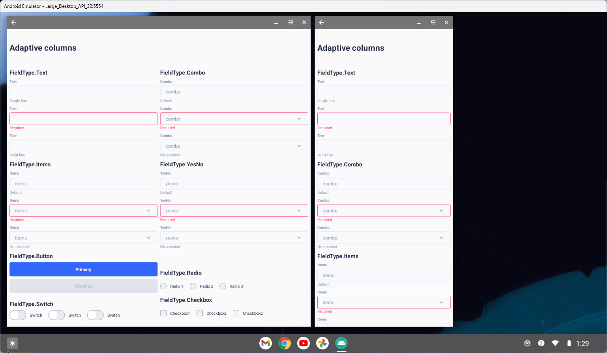
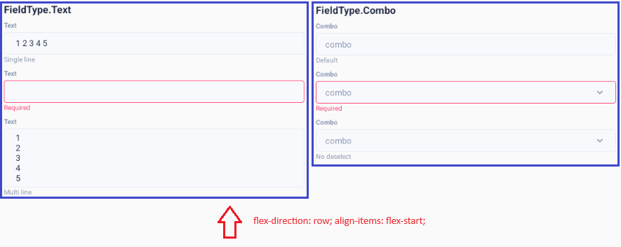
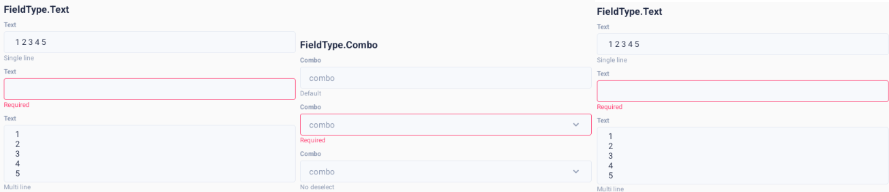
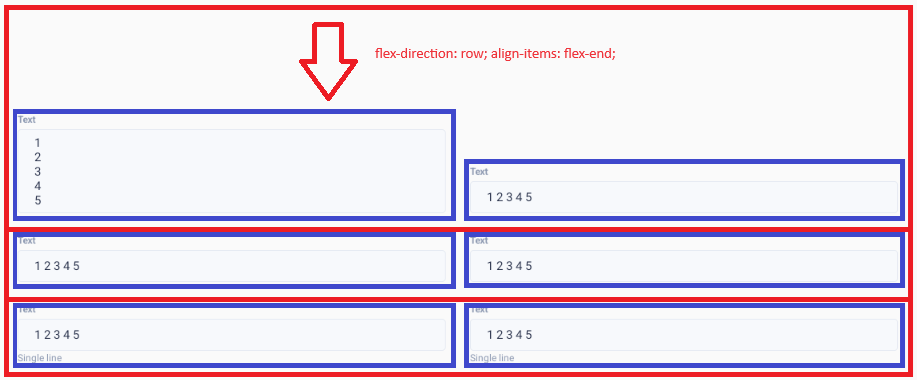

# Responsive Layout in React Native

> The challenges encountered when porting a classic React application to React Native are discussed in this article. It focuses on supporting various device form factors, including the Galaxy Fold.

This article describes the [rn-declarative library](https://github.com/react-declarative/rn-declarative). Check the readme for documentation updates!

## The problem

Some time ago, I started developing a mobile application with React Native. The issue is that the application needs to support both the Galaxy Fold and Samsung DeX.


As a result, the question of implementing adaptive layout forms arose. The same application needs to render forms in a single column mode on phones and two columns in tablet mode. If different layout codes are written, it would require duplicating form logic; at the very least, a new field would be added twice.


Yoga Layout, the layout engine from React Native, only supports flexbox. Consequently, implementing layouts correctly while avoiding excessive nesting of Views is a non-trivial task: nested groups must be displayed from the top edge of the parent, and input fields must align to the bottom edge of the display line (baseline).



Ignoring the rule of binding field groups to the top edge results in an ugly layout.



Fields within a group should be bound to the bottom edge of the row.



The ugliness of having a top baseline for fields is not immediately obvious but becomes very noticeable when using standard fields from Material 1 on Android 4.


## Solution

To delegate the complex task of proper form layout to a less specialized developer, a templating system was developed that generates layouts according to the rules mentioned above from a JSON template. An example template is shown in the code block below:

```tsx
import { One, FieldType, TypedField } from 'rn-declarative';

import { Text } from '@ui-kitten/components';
import { ScrollView } from 'react-native';

const fields: TypedField[] = [
    {
        type: FieldType.Component,
        style: {
            justifyContent: 'center',
            width: '100%',
            height: 125,
        },
        element: () => (
            <Text category='h4'>
                Adaptive columns
            </Text>
        ),
    },
    {
        type: FieldType.Group,
        style: {
            width: '100%',
        },
        fields: [
            {
                type: FieldType.Group,
                phoneStyle: {
                    width: '100%',
                },
                tabletStyle: {
                    width: '50%',
                },
                desktopStyle: {
                    width: '25%',
                },
                fields: [
                    {
                        type: FieldType.Component,
                        style: {
                            width: '100%',
                        },
                        element: () => (
                            <Text category='h6'>
                                FieldType.Text
                            </Text>
                        ),
                    },
                    {
                        type: FieldType.Text,
                        style: {
                            width: '100%',
                        },
                        name: 'text',
                        title: 'Text',
                        description: 'Single line',
                    },
                    {
                        type: FieldType.Text,
                        style: {
                            width: '100%',
                        },
                        validation: {
                            required: true,
                        },
                        dirty: true,
                        name: 'text_invalid',
                        title: 'Text',
                        description: 'Invalid',
                    },
                    {
                        type: FieldType.Text,
                        style: {
                            width: '100%',
                        },
                        inputMultiline: true,
                        name: 'text',
                        title: 'Text',
                        description: 'Multi line',
                    },
                ],
            },

            ...

];

export const MainPage = () => {
    return (
        <ScrollView>
            <One fields={fields} onChange={console.log} />
        </ScrollView>
    );
};

export default MainPage;
```

The library is divided into two modules: [rn-declarative](https://www.npmjs.com/package/rn-declarative)  and [rn-declarative-eva](https://www.npmjs.com/package/rn-declarative-eva) . The first contains the core logic and does not depend on a UI kit: it can be installed in any project regardless of the `react-native` version or framework (both `Expo` and `react-native-community` starter kits are supported). Besides `react` and `react-native`, there are no other dependencies.

```tsx
import { useMediaContext } from 'rn-declarative'

...

const { isPhone, isTablet, isDesktop } = useMediaContext();
```

Layout and field widths are configured using `phoneStyle`, `tabletStyle`, and `desktopStyle` properties. If you don't want to change the style based on the device form factor, you can just use `style`. Connecting a UI Kit is done through the context with slots `<OneSlotFactory />` for implementing `FieldType`.

```tsx
import { Toggle } from '@ui-kitten/components';
import { OneSlotFactory, ISwitchSlot } from 'rn-declarative';

export const Switch = ({
  disabled,
  value,
  onChange,
  onFocus,
  onBlur,
  title,
}: ISwitchSlot) => {
  return (
    <Toggle
      checked={Boolean(value)}
      disabled={disabled}
      onChange={() => onChange(!value)}
      onFocus={onFocus}
      onBlur={onBlur}
    >
      {title}  
    </Toggle>
  );
};

...

const defaultSlots = {
    CheckBox,
    Combo,
    Items,
    Radio,
    Button,
    Text,
    Switch,
    YesNo,
};

...

<OneSlotFactory
    {...defaultSlots}
>
    {children}
</OneSlotFactory>
```

P.S. Any other component or custom layout can be seamlessly integrated through `FieldType.Component` (with `onChange` and `value`) or `FieldType.Layout`.

```tsx
{
  type: FieldType.Component,
  element: () => (
      <Text category='h4'>
          Sample component
      </Text>
  ),
},

...

{
  type: FieldType.Layout,
  customLayout: ({ children }) => (
      <ScrollView>
          {children}
      </ScrollView>
  ),
},
```

The component code is published on GitHub and can be viewed at:
[https://github.com/react-declarative/rn-declarative/](https://github.com/react-declarative/rn-declarative/) 

Thank you for your attention!
