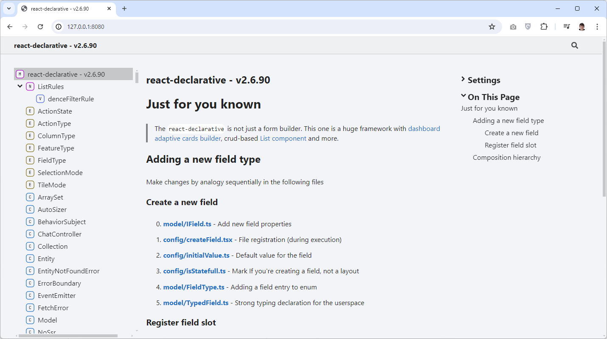

# Typedoc website

> In addition to [the playground](https://react-declarative-playground.github.io/) and the [storybook](http://react-declarative.github.io/) `react-declarative` provides the automatically generated Github Pages website for search engine indexing and GPT-4 reference

You can browse that documentation website by [following the link](https://react-declarative-typedoc.github.io/)

## Purpose

The GPT-4 models adopted to feed additional data from the search engines with automatic hallucination filters. While the context window is not full, the net being asked to answer `TRUE` if `2 + 2 = 4`. If the output is not equal to true, the net is hallucinating and the current google link is rolling back. The cursor mooving to the next link

So the important part of using AI integration is to publish documentation to the websites with good SEO optimization
