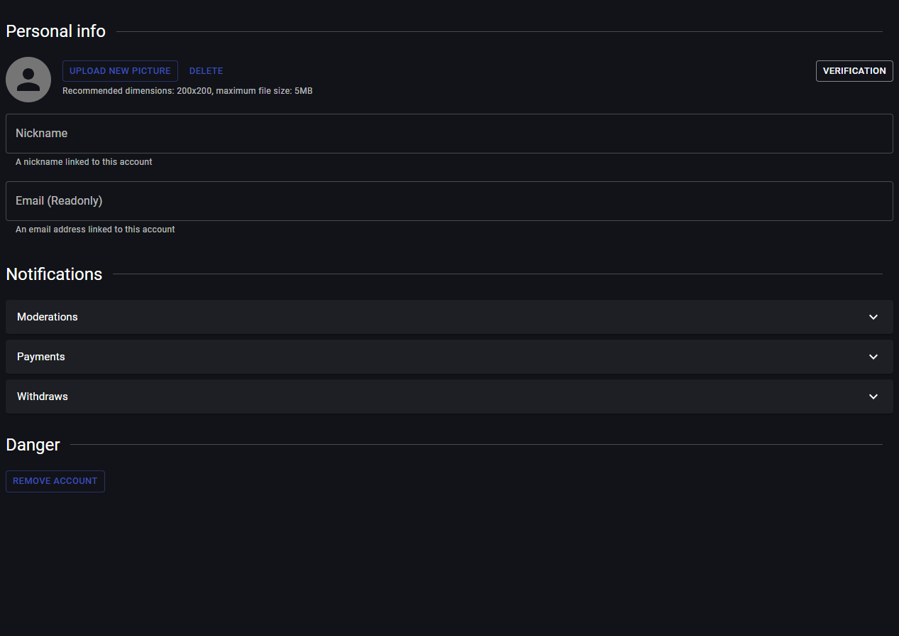

# Accounnt info

> Link to [the playground](https://react-declarative-playground.github.io/)



## Description

A user interface for an account settings page. Here are the key details:

 - The page is titled “Personal info”.
 - There are options to upload or delete a profile picture.
 - There’s a verification section.
 - Fields for ‘Nickname’ and ‘Email’ are present. The ‘Email’ field is read-only.
 - There are sections titled ‘Notifications,’ ‘Moderators,’ ‘Payments,’ and ‘Withdraws.’ Each of these sections has a dropdown arrow, indicating that more options can be viewed.
 - There’s also a ‘Danger’ section with an option to ‘REMOVE ACCOUNT’.

## Code

```tsx
import { TypedField, FieldType } from "react-declarative";

declare var RemoveAccount: any;
declare var AvatarPicker: any;

const personalFields: TypedField[] = [
  {
      type: FieldType.Line,
      title: 'Personal info',
  },
  {
      type: FieldType.Component,
      fieldBottomMargin: '0',
      element: () => <AvatarPicker />
  },
  {
      type: FieldType.Text,
      fieldRightMargin: '0',
      outlined: true,
      name: 'global.login',
      title: 'Nickname',
      description: 'A nickname linked to this account',
  },
  {
      type: FieldType.Text,
      fieldRightMargin: '0',
      outlined: true,
      name: 'global.email',
      readonly: true,
      title: 'Email (Readonly)',
      description: 'An email address linked to this account',
  },
];

const norifyFields: TypedField[] = [
  {
      type: FieldType.Line,
      title: 'Notifications',
  },
  {
      type: FieldType.Expansion,
      fieldRightMargin: '0',
      fieldBottomMargin: '1',
      title: 'Moderations',
      fields: [
          {
              type: FieldType.Switch,
              name: 'notify.moderation',
              fieldRightMargin: '0',
              title: 'Moderations',
              fieldBottomMargin: '0',
          },
          {
              type: FieldType.Typography,
              typoVariant: 'subtitle2',
              placeholder: 'Toggle moderation notifications',
              style: {
                  opacity: 0.5,
              },
              fieldBottomMargin: '0',
          },
      ],
  },
  {
      type: FieldType.Expansion,
      fieldRightMargin: '0',
      fieldBottomMargin: '1',
      title: 'Payments',
      fields: [
          {
              type: FieldType.Switch,
              name: 'notify.payment',
              fieldRightMargin: '0',
              title: 'Payments',
              fieldBottomMargin: '0',
          },
          {
              type: FieldType.Typography,
              typoVariant: 'subtitle2',
              fieldRightMargin: '0',
              placeholder: 'Toggle payments notifications',
              style: {
                  opacity: 0.5,
              },
              fieldBottomMargin: '0',
          },
      ],
  },
  {
      type: FieldType.Expansion,
      fieldRightMargin: '0',
      fieldBottomMargin: '1',
      title: 'Withdraws',
      fields: [
          {
              type: FieldType.Switch,
              name: 'notify.withdraw',
              fieldRightMargin: '0',
              title: 'Withdraws',
              fieldBottomMargin: '0',
          },
          {
              type: FieldType.Typography,
              typoVariant: 'subtitle2',
              fieldRightMargin: '0',
              placeholder: 'Toggle withdraw notifications',
              style: {
                  opacity: 0.5,
              },
              fieldBottomMargin: '0',
          },
      ],
  },
];

const dangerFields: TypedField[] = [
  {
      type: FieldType.Line,
      title: 'Danger',
  },
  {
      type: FieldType.Component,
      element: () => <RemoveAccount />,
  },
];

export const fields: TypedField[] = [
  ...personalFields,
  ...norifyFields,
  ...dangerFields,
];

```