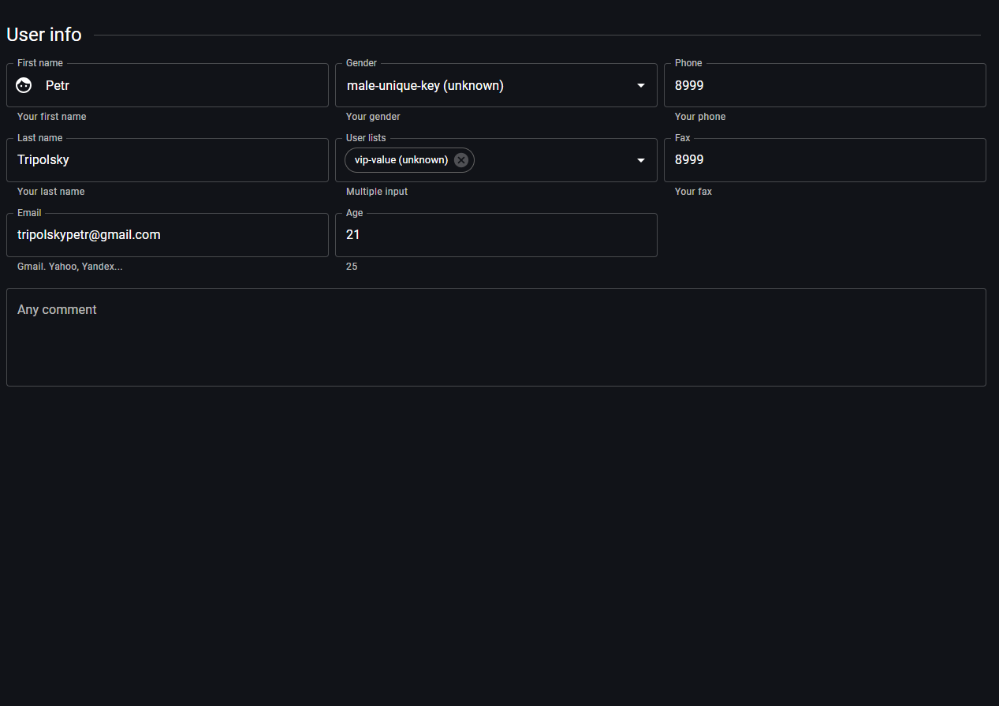

# Adaptive form

> Link to [the playground](https://react-declarative-playground.github.io/)



## Description

A form titled “User info” on a website. The form contains various fields for input, including:

 - First name
 - Last name
 - Email
 - Gender
 - Phone
 - A comment section

## Code

```tsx
import { TypedField, FieldType } from "react-declarative";

import { Face } from "@mui/icons-material";

export const fields: TypedField[] = [
  {
    type: FieldType.Line,
    title: "User info",
  },
  {
    type: FieldType.Group,
    phoneColumns: "12",
    tabletColumns: "6",
    desktopColumns: "4",
    fieldRightMargin: "0",
    fields: [
      {
        type: FieldType.Text,
        outlined: true,
        title: "First name",
        defaultValue: "Petr",
        description: "Your first name",
        leadingIcon: Face,
        name: "firstName",
      },
      {
        type: FieldType.Text,
        outlined: true,
        title: "Last name",
        defaultValue: "Tripolsky",
        description: "Your last name",
        name: "lastName",
      },
      {
        type: FieldType.Text,
        outlined: true,
        title: "Email",
        defaultValue: "tripolskypetr@gmail.com",
        description: "Gmail. Yahoo, Yandex...",
        name: "email",
      },
    ],
  },
  {
    type: FieldType.Group,
    phoneColumns: "12",
    tabletColumns: "6",
    desktopColumns: "4",
    fieldRightMargin: "0",
    fields: [
      {
        type: FieldType.Combo,
        outlined: true,
        name: "gender",
        title: "Gender",
        description: "Your gender",
        defaultValue: "male-unique-key",
      },
      {
        type: FieldType.Items,
        outlined: true,
        name: "lists",
        title: "User lists",
        description: "Multiple input",
        defaultValue: ["vip-value", "allow-value"],
      },
      {
        type: FieldType.Text,
        outlined: true,
        inputType: "number",
        title: "Age",
        defaultValue: "21",
        description: "25",
        name: "How old are you?",
      },
    ],
  },
  {
    type: FieldType.Group,
    phoneColumns: "12",
    tabletColumns: "6",
    desktopColumns: "4",
    fieldRightMargin: "0",
    fields: [
      {
        type: FieldType.Text,
        outlined: true,
        name: "phone",
        title: "Phone",
        description: "Your phone",
        inputType: "tel",
        defaultValue: "8999",
      },
      {
        type: FieldType.Text,
        outlined: true,
        name: "fax",
        title: "Fax",
        description: "Your fax",
        inputType: "tel",
        defaultValue: "8999",
      },
    ],
  },
  {
    type: FieldType.Text,
    outlined: true,
    name: "comment",
    title: "Any comment",
    inputRows: 4,
  },
];

```