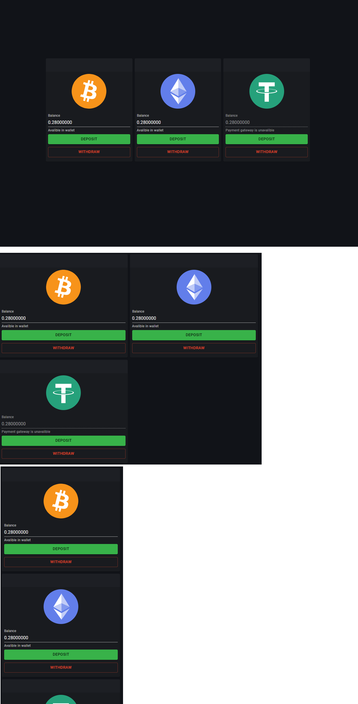

# Crypto form

> Link to [the playground](https://react-declarative-playground.github.io/)



## Description

Three separate sections related to cryptocurrency transactions. These sections include symbols for Bitcoin, Ethereum, and Tether, along with withdrawal and deposit buttons, amount of funds in wallet

# Code

```tsx
import { TypedField, FieldType } from "react-declarative";

declare var BtcCurrency;
declare var EthCurrency;
declare var UsdtCurrency;

export const fields: TypedField[] = [
  {
    type: FieldType.Center,
    sx: (theme) => ({
      [theme.breakpoints.up("lg")]: {
        height: '100vh',
        marginTop: '-56px',
      },
    }),
    child: {
      type: FieldType.Group,
      desktopColumns: '9',
      tabletColumns: '12',
      phoneColumns: '12',
      fields: [
        {
          type: FieldType.Component, 
          fieldRightMargin: '1',
          fieldBottomMargin: '1',
          phoneColumns: '12',
          tabletColumns: '6',
          desktopColumns: '4',
          element: BtcCurrency,
        },
        {
          type: FieldType.Component,
          fieldRightMargin: '1',
          fieldBottomMargin: '1',
          phoneColumns: '12',
          tabletColumns: '6',
          desktopColumns: '4',
          element: EthCurrency,
        },
        {
          type: FieldType.Component,
          fieldRightMargin: '1',
          fieldBottomMargin: '1',
          phoneColumns: '12',
          tabletColumns: '6',
          desktopColumns: '4',
          element: UsdtCurrency,
        },
      ]
    },
  },
];

```