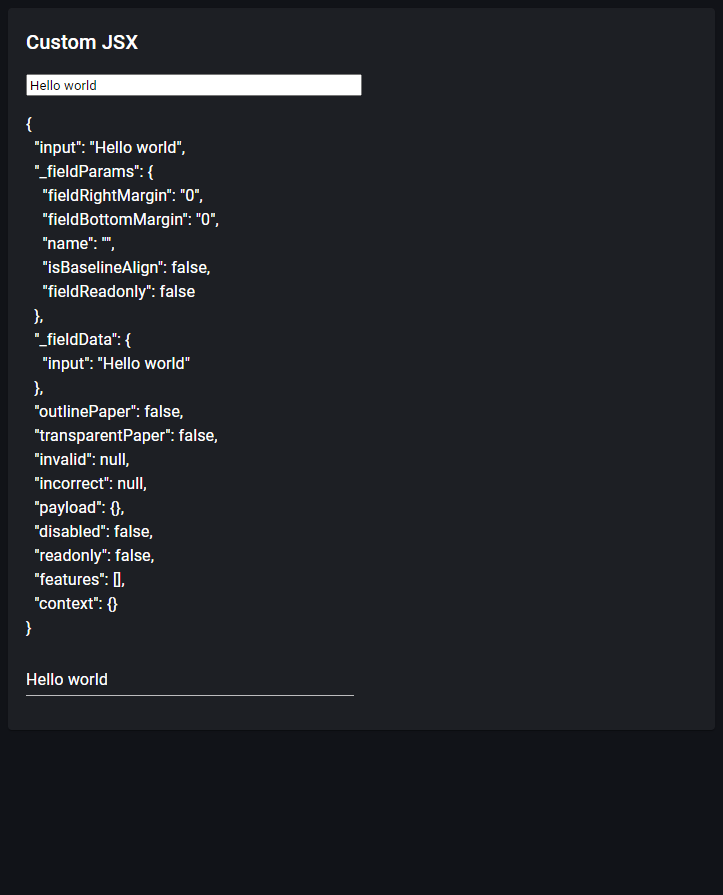

# Custom JSX

> Link to [the playground](https://react-declarative-playground.github.io/)



## Description

Demo of a custom JSX injection into the `<One />` component layout

# Code

```tsx
import { TypedField, FieldType } from "react-declarative";

export const fields: TypedField[] = [
    {
        type: FieldType.Paper,
        fieldBottomMargin: "1",
        fields: [
            {
                type: FieldType.Typography,
                typoVariant: 'h6',
                placeholder: "Custom JSX"
            },
            {
                type: FieldType.Component,
                desktopColumns: '4',
                tabletColumns: '6',
                phoneColumns: '12',
                name: 'input',
                defaultValue: "Hello world",
                element: ({ input, onValueChange }) => <input value={input} onChange={({ target }) => onValueChange(target.value)} />,
            },
            {
                type: FieldType.Component,
                element: (params) => <pre>{JSON.stringify(params, null, 2)}</pre>,
            },
            {
                type: FieldType.Text,
                desktopColumns: '4',
                tabletColumns: '6',
                phoneColumns: '12',
                name: 'input',
                title: "",
                placeholder: "input",
            },
        ],
    },   
];
```
