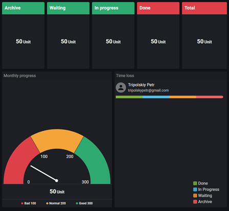

# Dasboard

> Link to [the playground](https://react-declarative-playground.github.io/)



## Description

A dashboard for project management or performance metrics. Here’s a detailed description:

 - There are five rectangular boxes at the top labeled as “Archive,” “Waiting,” “In progress,” “Done,” and “Total.” Each of these boxes contains the text “50 Unit.”
 - Below these boxes, there’s a semi-circular gauge chart labeled “Monthly Progress” with a scale from 0 to 300. The gauge is divided into three zones: “Bad” (0 to 100, colored red), “Normal” (100 to 200, colored yellow), and “Good” (200 to 300, colored green). The needle of the gauge is pointing just past the middle of the yellow zone, around the value of 150.
 - Next to this chart, there’s a legend correlating colors to statuses: red for “Done,” orange for “Waiting,” green for “In Progress,” and purple for “Archive.”
 - An email address, “tripolskypetr@gmail.com,” is also displayed on the dashboard.

## Code

```tsx
import { TypedField, FieldType } from "react-declarative";

const CC_FULL_HEIGHT = "calc(100vh - 80px)";

declare var MonthProgressWrapper;
declare var TimeLossWrapper;
declare var IndicatorProgressWrapper;
declare var IndicatorWaitingWrapper;
declare var IndicatorArchiveWrapper;
declare var IndicatorDoneWrapper;
declare var IndicatorAllWrapper;

export const fields: TypedField[] = [
  {
    type: FieldType.Group,
    fields: [
      {
        type: FieldType.Group,
        fields: [
          {
            type: FieldType.Group,
            columnsOverride: '5',
            fields: [
              {
                type: FieldType.Hero,
                height: `calc(${CC_FULL_HEIGHT} / 3)`,
                columns: '1',
                phoneColumns: '5',
                right: '10px',
                phoneRight: "0px",
                bottom: '10px',
                minHeight: '225px',
                child: {
                  type: FieldType.Component,
                  element: IndicatorArchiveWrapper,
                },
              },
              {
                type: FieldType.Hero,
                height: `calc(${CC_FULL_HEIGHT} / 3)`,
                columns: '1',
                phoneColumns: '5',
                right: '10px',
                phoneRight: "0px",
                bottom: '10px',
                minHeight: '225px',
                child: {
                  type: FieldType.Component,
                  element: IndicatorWaitingWrapper,
                },
              },
              {
                type: FieldType.Hero,
                height: `calc(${CC_FULL_HEIGHT} / 3)`,
                columns: '1',
                phoneColumns: '5',
                right: '10px',
                phoneRight: "0px",
                bottom: '10px',
                minHeight: '225px',
                child: {
                  type: FieldType.Component,
                  element: IndicatorProgressWrapper,
                },
              },
              {
                type: FieldType.Hero,
                height: `calc(${CC_FULL_HEIGHT} / 3)`,
                columns: '1',
                phoneColumns: '5',
                right: '10px',
                phoneRight: "0px",
                bottom: '10px',
                minHeight: '225px',
                child: {
                  type: FieldType.Component,
                  element: IndicatorDoneWrapper,
                },
              },
              {
                type: FieldType.Hero,
                height: `calc(${CC_FULL_HEIGHT} / 3)`,
                columns: '1',
                phoneColumns: '5',
                bottom: '10px',
                minHeight: '225px',
                child: {
                  type: FieldType.Component,
                  element: IndicatorAllWrapper,
                },
              },
            ]
          },
          {
            type: FieldType.Hero,
            height: `calc(${CC_FULL_HEIGHT} / 3 * 2)`,
            columns: '6',
            phoneColumns: '12',
            phoneBottom: '10px',
            tabletBottom: '10px',
            right: '10px',
            phoneRight: "0px",
            minHeight: '400px',
            child: {
              type: FieldType.Component,
              element: MonthProgressWrapper,
            },
          },
          {
            type: FieldType.Hero,
            height: `calc(${CC_FULL_HEIGHT} / 3 * 2)`,
            columns: '6',
            phoneColumns: '12',
            phoneBottom: '10px',
            tabletBottom: '10px',
            minHeight: '400px',
            child: {
              type: FieldType.Component,
              element: TimeLossWrapper,
            },
          },
        ]
      }
    ]
  },
  {
    type: FieldType.Group,
    fieldBottomMargin: "0",
    fieldRightMargin: "0",
    columnsOverride: '5',
    fields: [
      {
        type: FieldType.Group,
        fieldBottomMargin: "0",
        columns: "1",
        phoneColumns: "5",
        tabletColumns: "5",
        fields: [
          {
            type: FieldType.Line,
            lineTransparent: true,
            title: "Archive",
          },
          {
            type: FieldType.Slider,
            name: "archive_count",
            minSlider: 0,
            maxSlider: 500,
            defaultValue: 50,
          },
          {
            type: FieldType.Combo,
            name: "archive_limit_bg",
            title: 'Archive limit',
            itemList: [
              "semi",
              "solid",
              "unset"
            ],
            defaultValue: "semi",
            tr: async (entry) => {
              const trMap = {
                "semi": "Semi",
                "solid": "Solid",
                "unset": "Unset",
              }
              return trMap[entry] || entry;
            },
            noDeselect: true,
          },
          {
            type: FieldType.Text,
            name: "archive_low_limit",
            defaultValue: "100",
            title: 'Lower archive limit',
            inputFormatterAllowed: /^[0-9]/,
            inputFormatterTemplate: "0000000000000000",
          },
          {
            type: FieldType.Text,
            name: "archive_medium_limit",
            defaultValue: "200",
            title: 'Average archive limit',
            inputFormatterAllowed: /^[0-9]/,
            inputFormatterTemplate: "0000000000000000",
          },
          {
            type: FieldType.Text,
            name: "archive_high_limit",
            defaultValue: "300",
            title: 'Upper archive limit',
            fieldBottomMargin: "0",
            inputFormatterAllowed: /^[0-9]/,
            inputFormatterTemplate: "0000000000000000",
          },
        ],
      },
      {
        type: FieldType.Group,
        fieldBottomMargin: "0",
        columns: "1",
        phoneColumns: "5",
        tabletColumns: "5",
        fields: [
          {
            type: FieldType.Line,
            lineTransparent: true,
            title: "Waiting",
          },
          {
            type: FieldType.Slider,
            name: "waiting_count",
            minSlider: 0,
            maxSlider: 500,
            defaultValue: 50,
          },
          {
            type: FieldType.Combo,
            name: "waiting_limit_bg",
            title: 'Waiting limit',
            defaultValue: "semi",
            itemList: [
              "semi",
              "solid",
              "unset"
            ],
            tr: async (entry) => {
              const trMap = {
                "semi": "Semi",
                "solid": "Solid",
                "unset": "Unset",
              }
              return trMap[entry] || entry;
            },
            noDeselect: true,
          },
          {
            type: FieldType.Text,
            name: "waiting_low_limit",
            defaultValue: "100",
            title: 'Lower expectation limit',
            inputFormatterAllowed: /^[0-9]/,
            inputFormatterTemplate: "0000000000000000",
          },
          {
            type: FieldType.Text,
            name: "waiting_medium_limit",
            defaultValue: "200",
            title: 'Average expectation limit',
            inputFormatterAllowed: /^[0-9]/,
            inputFormatterTemplate: "0000000000000000",
          },
          {
            type: FieldType.Text,
            name: "waiting_high_limit",
            defaultValue: "300",
            title: 'Upper Expectation Limit',
            fieldBottomMargin: "0",
            inputFormatterAllowed: /^[0-9]/,
            inputFormatterTemplate: "0000000000000000",
          },
        ],
      },
      {
        type: FieldType.Group,
        fieldBottomMargin: "0",
        columns: "1",
        phoneColumns: "5",
        tabletColumns: "5",
        fields: [
          {
            type: FieldType.Line,
            lineTransparent: true,
            title: "Progress",
          },
          {
            type: FieldType.Slider,
            name: "inprogress_count",
            minSlider: 0,
            maxSlider: 500,
            defaultValue: 50,
          },
          {
            type: FieldType.Combo,
            name: "inprogress_limit_bg",
            title: 'Progress limit',
            defaultValue: "semi",
            itemList: [
              "semi",
              "solid",
              "unset",
            ],
            tr: async (entry) => {
              const trMap = {
                "semi": "Semi",
                "solid": "Solid",
                "unset": "Unset",
              }
              return trMap[entry] || entry;
            },
            noDeselect: true,
          },
          {
            type: FieldType.Text,
            name: "inprogress_low_limit",
            defaultValue: "100",
            title: 'Lower progress limit',
            inputFormatterAllowed: /^[0-9]/,
            inputFormatterTemplate: "0000000000000000",
          },
          {
            type: FieldType.Text,
            name: "inprogress_medium_limit",
            defaultValue: "200",
            title: 'Average progress limit',
            inputFormatterAllowed: /^[0-9]/,
            inputFormatterTemplate: "0000000000000000",
          },
          {
            type: FieldType.Text,
            name: "inprogress_high_limit",
            defaultValue: "300",
            title: 'Upper progress limit',
            fieldBottomMargin: "0",
            inputFormatterAllowed: /^[0-9]/,
            inputFormatterTemplate: "000000000000000",
          },
        ]
      },
      {
        type: FieldType.Group,
        fieldBottomMargin: "0",
        columns: "1",
        phoneColumns: "5",
        tabletColumns: "5",
        fields: [
          {
            type: FieldType.Line,
            lineTransparent: true,
            title: "Done",
          },
          {
            type: FieldType.Slider,
            name: "done_count",
            minSlider: 0,
            maxSlider: 500,
            defaultValue: 50,
          },
          {
            type: FieldType.Combo,
            name: "done_limit_bg",
            title: 'Execution limit',
            defaultValue: "semi",
            itemList: [
              "semi",
              "solid",
              "unset",
            ],
            tr: async (entry) => {
              const trMap = {
                "semi": "Semi",
                "solid": "Solid",
                "unset": "Unset",
              }
              return trMap[entry] || entry;
            },
            noDeselect: true,
          },
          {
            type: FieldType.Text,
            name: "done_low_limit",
            title: 'Lower Execution Limit',
            defaultValue: '100',
            inputFormatterAllowed: /^[0-9]/,
            inputFormatterTemplate: "0000000000000000",
          },
          {
            type: FieldType.Text,
            name: "done_medium_limit",
            title: 'Average Execution Limit',
            defaultValue: '200',
            inputFormatterAllowed: /^[0-9]/,
            inputFormatterTemplate: "0000000000000000",
          },
          {
            type: FieldType.Text,
            fieldBottomMargin: "0",
            name: "done_high_limit",
            title: 'Upper Execution Limit',
            defaultValue: '300',
            inputFormatterAllowed: /^[0-9]/,
            inputFormatterTemplate: "0000000000000000",
          },
        ],
      },
      {
        type: FieldType.Group,
        fieldBottomMargin: "0",
        columns: "1",
        phoneColumns: "5",
        tabletColumns: "5",
        fields: [
          {
            type: FieldType.Line,
            lineTransparent: true,
            title: "Total",
          },
          {
            type: FieldType.Slider,
            name: "all_count",
            minSlider: 0,
            maxSlider: 500,
            defaultValue: 50,
          },
          {
            type: FieldType.Combo,
            name: "all_limit_bg",
            title: 'Limit of all',
            defaultValue: "semi",
            itemList: [
              "semi",
              "solid",
              "unset",
            ],
            tr: async (entry) => {
              const trMap = {
                "semi": "Semi",
                "solid": "Solid",
                "unset": "Unset",
              }
              return trMap[entry] || entry;
            },
            noDeselect: true,
          },
          {
            type: FieldType.Text,
            name: "all_low_limit",
            title: "Lower limit of all",
            defaultValue: '100',
            inputFormatterAllowed: /^[0-9]/,
            inputFormatterTemplate: "0000000000000000",
          },
          {
            type: FieldType.Text,
            name: "all_medium_limit",
            title: 'Average limit of all',
            defaultValue: '200',
            inputFormatterAllowed: /^[0-9]/,
            inputFormatterTemplate: "0000000000000000",
          },
          {
            type: FieldType.Text,
            name: "all_high_limit",
            title: 'Upper limit of all',
            defaultValue: '300',
            fieldBottomMargin: "0",
            inputFormatterAllowed: /^[0-9]/,
            inputFormatterTemplate: "0000000000000000",
          },
        ],
      },
    ]
  },
  {
    type: FieldType.Group,
    desktopColumns: "6",
    tabletColumns: "12",
    phoneColumns: "12",
    fields: [
      {
        type: FieldType.Line,
        lineTransparent: true,
        title: "Monthly progress",
      },
      {
        type: FieldType.Slider,
        name: "monthprogress_count",
        minSlider: 0,
        maxSlider: 500,
        defaultValue: 50,
      },
      {
        type: FieldType.Text,
        name: "monthprogress_low_limit",
        defaultValue: '100',
        title: 'Lower limit of monthly progress',
        inputFormatterAllowed: /^[0-9]/,
        inputFormatterTemplate: "0000000000000000",
      },
      {
        type: FieldType.Text,
        name: "monthprogress_medium_limit",
        title: 'Average progress limit per month',
        defaultValue: '200',
        inputFormatterAllowed: /^[0-9]/,
        inputFormatterTemplate: "0000000000000000",
      },
      {
        type: FieldType.Text,
        name: "monthprogress_high_limit",
        title: 'Upper limit of monthly progress',
        defaultValue: '300',
        inputFormatterAllowed: /^[0-9]/,
        inputFormatterTemplate: "0000000000000000",
      },
    ],
  },
  {
    type: FieldType.Component,
    element: ({ _fieldData: data }) => <pre>{JSON.stringify(data, null, 2)}</pre>,
  }
]
```