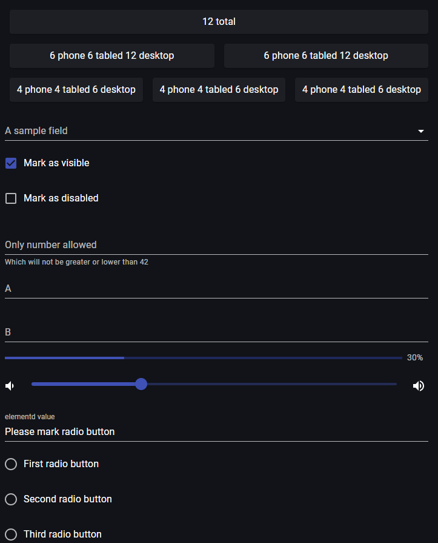

# Gallery of controls

> Link to [the playground](https://react-declarative-playground.github.io/)



## Description

A digital interface with various interactive elements. Here’s a detailed description:

 - At the top, there’s a counter indicating “12 total” with buttons below it labeled “6 phone 4 tablet 6 desktop,” “4 phone 6 tablet 4 desktop,” and “6 phone 4 tablet 2 desktop.”

 - Below this, there are two toggle switches; one is enabled and marked as visible, the other is disabled.

 - Next, there’s a numeric input field with instructions that only numbers lower than 42 are allowed; however, no number is shown in the field.

 - Following this, there are two sliders labeled ‘A’ and ‘B’, each set to different positions; ‘A’ at approximately two-thirds and ‘B’ at around one-third of their respective tracks.

 - Lastly, at the bottom of the image, there are three radio buttons accompanied by text labels: “First radio button,” “Second radio button,” and “Third radio button.” The second radio button appears to be selected.

## Code

```tsx
import { TypedField, FieldType } from "react-declarative";

import { Paper, Box } from "@mui/material";

import {
    VolumeDown,
    VolumeUp,
    CalendarToday,
    Alarm,
    Face,
} from '@mui/icons-material';

const Rect = ({ children }) => (
    <Paper sx={{ m: 1 }}>
        <Box display="flex" alignItems="center" justifyContent="center" p={1}>
            {children}
        </Box>
    </Paper>
);

export const fields: TypedField[] = [
    {
        type: FieldType.Group,
        fields: [
{
        type: FieldType.Group,
        columns: '12',
        fields: [
            {
                type: FieldType.Component,
                element: () => <Rect>12 total</Rect>,
            },
        ]
    },
    {
        type: FieldType.Group,
        desktopColumns: '12',
        phoneColumns: '6',
        tabletColumns: '6',
        fields: [
            {
                type: FieldType.Component,
                element: () => <Rect>6 phone 6 tabled 12 desktop</Rect>,
            }
        ],
    },
    {
        type: FieldType.Group,
        desktopColumns: '12',
        phoneColumns: '6',
        tabletColumns: '6',
        fields: [
            {
                type: FieldType.Component,
                element: () => <Rect>6 phone 6 tabled 12 desktop</Rect>,
            }
        ],
    },
    {
        type: FieldType.Group,
        desktopColumns: '6',
        phoneColumns: '4',
        tabletColumns: '4',
        fields: [
            {
                type: FieldType.Component,
                element: () => <Rect>4 phone 4 tabled 6 desktop</Rect>,
            }
        ],
    },
    {
        type: FieldType.Group,
        desktopColumns: '6',
        phoneColumns: '4',
        tabletColumns: '4',
        fields: [
            {
                type: FieldType.Component,
                element: () => <Rect>4 phone 4 tabled 6 desktop</Rect>,
            }
        ],
    },
    {
        type: FieldType.Group,
        desktopColumns: '6',
        phoneColumns: '4',
        tabletColumns: '4',
        fields: [
            {
                type: FieldType.Component,
                element: () => <Rect>4 phone 4 tabled 6 desktop</Rect>,
            }
        ],
    },
        ],
    },
    {
        type: FieldType.Items,
        title: 'A sample field',
        placeholder: 'Multiple selection',
        name: 'items',
        itemList: ['a', 'b', 'c'],
        isVisible: (obj) => obj.visible,
        isDisabled: (obj) => obj.disabled,
    },
    {
        type: FieldType.Checkbox,
        title: 'Mark as visible',
        defaultValue: true,
        name: 'visible',
    },
    {
        type: FieldType.Checkbox,
        title: 'Mark as disabled',
        defaultValue: false,
        name: 'disabled',
    },
    {
        type: FieldType.Text,
        // inputType: 'number',
        title: 'Only number allowed',
        description: 'Which will not be greater or lower than 42',
        name: 'text',
        isInvalid(obj) {
            if (isNaN(obj.text)) {
                return 'It is not a number';
            }
            if (obj.text != 42) {
                return 'The number is greater or lower than 42';
            }
            return null;
        },
        invalidity() {
            console.log(`
          It looks  like form  has  invalid value
          in the field. The save button should be
          disabled
        `);
        },
    },
    {
        type: FieldType.Text,
        name: 'a',
        focus() { console.log('focus a') },
        blur() { console.log('blur a') },
    },
    {
        type: FieldType.Text,
        name: 'b',
        focus() { console.log('focus b') },
    },
    {
        type: FieldType.Progress,
        showPercentLabel: true,
        maxPercent: 100,
        name: 'slider',
    },
    {
        type: FieldType.Slider,
        name: 'slider',
        leadingIcon: VolumeDown,
        trailingIcon: VolumeUp,
        defaultValue: 30,
        leadingIconClick(v, d, p, onChange) { onChange(v - 10) },
        trailingIconClick(v, d, p, onChange) { onChange(v + 10) },
    },
    {
        type: FieldType.Text,
        title: 'elementd value',
        compute(obj) {
            if (obj.radio === 'first') {
                return 'It looks like radio #1 was cheched';
            } else if (obj.radio === 'second') {
                return 'It looks like radio #2 was cheched';
            } else if (obj.radio === 'third') {
                return 'It looks like radio #3 was cheched';
            } else {
                return 'Please mark radio button';
            }
        },
    },
    {
        type: FieldType.Radio,
        title: 'First radio button',
        name: 'radio',
        radioValue: 'first',
    },
    {
        type: FieldType.Radio,
        title: 'Second radio button',
        name: 'radio',
        radioValue: 'second',
    },
    {
        type: FieldType.Radio,
        title: 'Third radio button',
        name: 'radio',
        radioValue: 'third',
    },
    {
        type: FieldType.Text,
        title: 'Pick date',
        description: 'By using trailing icon',
        name: 'date',
        trailingIcon: CalendarToday,
        readonly: true,
        trailingIconClick: (v, d, p, onChange) => pickDate().then((d) => {
            if (d) {
                onChange(d.format('MM-DD-YYYY'));
            } else {
                onChange('Rejected :-(');
            }
        }),
    },
    {
        type: FieldType.Text,
        title: 'Pick time',
        description: 'By using leading icon',
        name: 'time',
        leadingIcon: Alarm,
        readonly: true,
        defaultValue: '12:00',
        leadingIconClick: (v, d, p, onChange) => pickTime().then((t) => {
            if (t) {
                onChange(t.format('H:mm'));
            } else {
                onChange('Rejected :-(');
            }
        }),
    },
    {
        type: FieldType.Text,
        title: 'Pick name',
        description: 'Firstname, Lastname, Patronymic',
        name: 'fio',
        trailingIcon: Face,
        readonly: true,
        trailingIconClick: (v, d, p, onChange) => pickOne().then((input) => {
            if (input) {
                const { f, l, p } = input;
                onChange([f, l, p].join(' '));
            } else {
                onChange('Rejected :-(');
            }
        }),
    },
];
```
