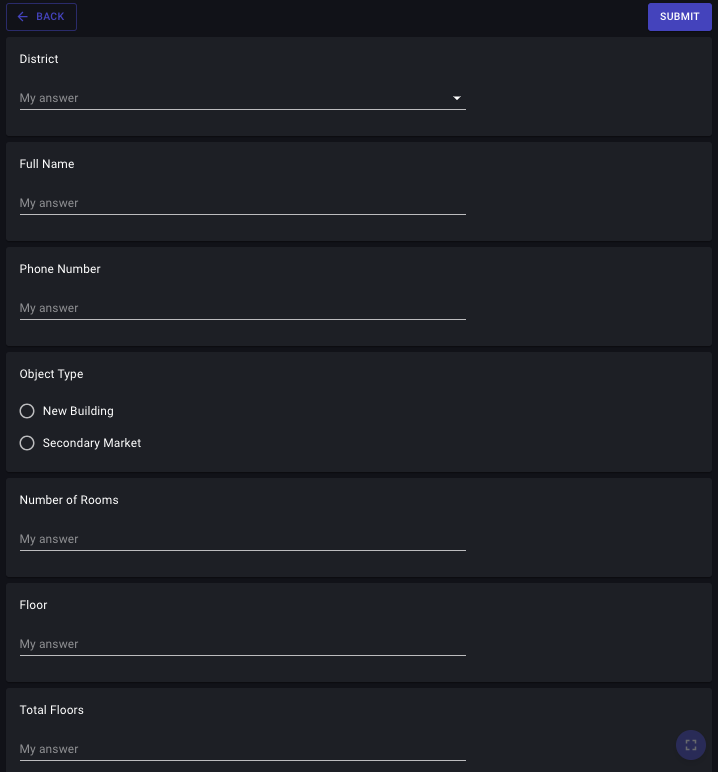

# Google forms

> Link to [the playground](https://react-declarative-playground.github.io/)



## Description

The form related to real estate or property inquiries, with fields for district, full name, phone number, object type (new building or secondary market), floor, and total floors styled as google forms. 

# Code

```tsx
import { IField, TypedField, FieldType } from "react-declarative";

import { ArrowBack } from "@mui/icons-material";

interface IBooleanGroupParams<Data extends object = any> {
  validation?: IField<Data>["validation"];
  phoneColumns?: IField<Data>["phoneColumns"];
  tabletColumns?: IField<Data>["tabletColumns"];
  desktopColumns?: IField<Data>["desktopColumns"];
  columns?: IField<Data>["columns"];
  name: IField<Data>["name"];
  title: IField<Data>["title"];
  isVisible?: IField<Data>["isVisible"];
  hidden?: IField<Data>["hidden"];
}

export const createBooleanGroup = ({
  phoneColumns,
  tabletColumns,
  desktopColumns,
  validation,
  columns,
  name,
  title,
  isVisible,
  hidden,
}: IBooleanGroupParams): TypedField => ({
  type: FieldType.Paper,
  fieldBottomMargin: "1",
  isVisible,
  hidden,
  phoneColumns,
  tabletColumns,
  desktopColumns,
  columns,
  fields: [
    {
      type: FieldType.Typography,
      typoVariant: "body1",
      placeholder: title,
    },
    {
      type: FieldType.YesNo,
      validation,
      desktopColumns: "6",
      tabletColumns: "8",
      phoneColumns: "12",
      name,
      title: "",
      placeholder: "My answer",
      tr: (key) => {
        if (key === "Yes") {
          return "Yes";
        }
        if (key === "No") {
          return "No";
        }
        return "";
      },
    },
  ],
});

interface IComboGroupParams<Data extends object = any> {
  validation?: IField<Data>["validation"];
  phoneColumns?: IField<Data>["phoneColumns"];
  tabletColumns?: IField<Data>["tabletColumns"];
  desktopColumns?: IField<Data>["desktopColumns"];
  columns?: IField<Data>["columns"];
  name: IField<Data>["name"];
  title: IField<Data>["title"];
  isVisible?: IField<Data>["isVisible"];
  hidden?: IField<Data>["hidden"];
  itemList?: string[];
}

export const createComboGroup = ({
  phoneColumns,
  tabletColumns,
  desktopColumns,
  columns,
  name,
  title,
  isVisible,
  validation,
  itemList = ["Mock 1", "Mock 2", "Mock 3"],
  hidden,
}: IComboGroupParams): TypedField => ({
  type: FieldType.Paper,
  fieldBottomMargin: "1",
  isVisible,
  hidden,
  phoneColumns,
  tabletColumns,
  desktopColumns,
  columns,
  fields: [
    {
      type: FieldType.Typography,
      typoVariant: "body1",
      placeholder: title,
    },
    {
      type: FieldType.Combo,
      validation,
      desktopColumns: "6",
      tabletColumns: "8",
      phoneColumns: "12",
      itemList,
      name,
      title: "",
      placeholder: "My answer",
    },
  ],
});

interface IItemsGroupParams<Data extends object = any> {
  validation?: IField<Data>["validation"];
  phoneColumns?: IField<Data>["phoneColumns"];
  tabletColumns?: IField<Data>["tabletColumns"];
  desktopColumns?: IField<Data>["desktopColumns"];
  columns?: IField<Data>["columns"];
  name: IField<Data>["name"];
  title: IField<Data>["title"];
  isVisible?: IField<Data>["isVisible"];
  hidden?: IField<Data>["hidden"];
  itemList?: string[];
}

export const createItemsGroup = ({
  phoneColumns,
  tabletColumns,
  desktopColumns,
  columns,
  name,
  title,
  isVisible,
  validation,
  itemList = ["Mock 1", "Mock 2", "Mock 3"],
  hidden,
}: IItemsGroupParams): TypedField => ({
  type: FieldType.Paper,
  fieldBottomMargin: "1",
  isVisible,
  hidden,
  phoneColumns,
  tabletColumns,
  desktopColumns,
  columns,
  fields: [
    {
      type: FieldType.Typography,
      typoVariant: "body1",
      placeholder: title,
    },
    {
      type: FieldType.Items,
      validation,
      desktopColumns: "6",
      tabletColumns: "8",
      phoneColumns: "12",
      itemList,
      name,
      title: "",
      placeholder: "My answer",
    },
  ],
});


interface INode { label: string; value: string; child?: Omit<INode, "child">[]; }

interface IItemsGroupParams<Data extends object = any> {
    validation?: IField<Data>["validation"];
    phoneColumns?: IField<Data>["phoneColumns"];
    tabletColumns?: IField<Data>["tabletColumns"];
    desktopColumns?: IField<Data>["desktopColumns"];
    columns?: IField<Data>["columns"];
    name: IField<Data>["name"];
    title: IField<Data>["title"];
    isVisible?: IField<Data>["isVisible"];
    hidden?: IField<Data>["hidden"];
    itemTree?: INode[];
}

export const createTreeGroup = ({
    phoneColumns,
    tabletColumns,
    desktopColumns,
    columns,
    name,
    title,
    isVisible,
    validation,
    itemTree = [],
    hidden,
}: IItemsGroupParams): TypedField => ({
    type: FieldType.Paper,
    fieldBottomMargin: "1",
    isVisible,
    hidden,
    phoneColumns,
    tabletColumns,
    desktopColumns,
    columns,
    fields: [
        {
            type: FieldType.Typography,
            typoVariant: "body1",
            placeholder: title,
        },
        {
            type: FieldType.Tree,
            validation,
            desktopColumns: "6",
            tabletColumns: "8",
            phoneColumns: "12",
            itemTree,
            name,
            title: "",
            placeholder: "Мой ответ",
        },
    ],
});

interface IRadioGroupParams<Data extends object = any> {
  phoneColumns?: IField<Data>["phoneColumns"];
  tabletColumns?: IField<Data>["tabletColumns"];
  desktopColumns?: IField<Data>["desktopColumns"];
  columns?: IField<Data>["columns"];
  name: IField<Data>["name"];
  title: IField<Data>["title"];
  isVisible?: IField<Data>["isVisible"];
  hidden?: IField<Data>["hidden"];
  radioItems?: string[];
}

export const createRadioGroup = ({
  phoneColumns,
  tabletColumns,
  desktopColumns,
  columns,
  name,
  title,
  isVisible,
  radioItems = ["Mock 1", "Mock 2", "Mock 3"],
  hidden,
}: IRadioGroupParams): TypedField => ({
  type: FieldType.Paper,
  fieldBottomMargin: "1",
  isVisible,
  hidden,
  phoneColumns,
  tabletColumns,
  desktopColumns,
  columns,
  fields: [
    {
      type: FieldType.Box,
      sx: {
        display: "grid",
        gridTemplateColumns: "auto 1fr auto",
      },
      fields: [
        {
          type: FieldType.Typography,
          typoVariant: "body1",
          placeholder: title,
        },
        {
          type: FieldType.Div,
        },
        {
          type: FieldType.Button,
          fieldBottomMargin: '0',
          fieldRightMargin: '0',
          sx: {
            width: "125px",
          },
          isVisible: (data) => {
            return !!data[name];
          },
          title: "Deselect",
          buttonSize: 'small',
          click: ({}, {}, {}, {}, {}, onChange) => {
            onChange({
              [name]: null,
            });
          },
        },
      ],
    },
    ...radioItems.map(
      (radioValue): TypedField => ({
        type: FieldType.Radio,
        fieldRightMargin: "0",
        fieldBottomMargin: "0",
        title: radioValue,
        name,
        radioValue,
      }),
    ),
  ],
});

interface ITextGroupParams<Data extends object = any> {
  validation?: IField<Data>["validation"];
  phoneColumns?: IField<Data>["phoneColumns"];
  tabletColumns?: IField<Data>["tabletColumns"];
  desktopColumns?: IField<Data>["desktopColumns"];
  columns?: IField<Data>["columns"];
  name: IField<Data>["name"];
  title: IField<Data>["title"];
  isVisible?: IField<Data>["isVisible"];
  hidden?: IField<Data>["hidden"];
  inputFormatterAllowed?: IField<Data>["inputFormatterAllowed"];
  inputFormatterTemplate?: IField<Data>["inputFormatterTemplate"];
}

export const createTextGroup = ({
  phoneColumns,
  tabletColumns,
  desktopColumns,
  validation,
  columns,
  name,
  title,
  isVisible,
  hidden,
  inputFormatterAllowed,
  inputFormatterTemplate,
}: ITextGroupParams): TypedField => ({
  type: FieldType.Paper,
  fieldBottomMargin: "1",
  isVisible,
  hidden,
  phoneColumns,
  tabletColumns,
  desktopColumns,
  columns,
  fields: [
    {
      type: FieldType.Typography,
      typoVariant: "body1",
      placeholder: title,
    },
    {
      type: FieldType.Text,
      validation,
      desktopColumns: "6",
      tabletColumns: "8",
      phoneColumns: "12",
      name,
      title: "",
      placeholder: "My answer",
      inputFormatterAllowed,
      inputFormatterTemplate,
    },
  ],
});

export const fields: TypedField[] = [
  {
    type: FieldType.Box,
    sx: {
      display: "grid",
      gridTemplateColumns: "auto 1fr auto",
      alignItems: "center",
    },
    fields: [
      {
        type: FieldType.Button,
        fieldBottomMargin: "1",
        fieldRightMargin: "0",
        buttonVariant: "outlined",
        icon: ArrowBack,
        title: "Back",
      },
      {
        type: FieldType.Div,
      },
      {
        type: FieldType.Button,
        fieldBottomMargin: "1",
        fieldRightMargin: "0",
        buttonVariant: "contained",
        name: "submit",
        title: "Submit",
      },
    ],
  },
  createComboGroup({
    name: "district",
    title: "District",
    itemList: [
      "Almazar District",
      "Bektemir District",
      "Mirabad District",
      "Mirzo-Ulugbek District",
      "Sergeli District",
      "Uchtepa District",
      "Chilanzar District",
      "Shaykhantahur District",
      "Yunusabad District",
      "Yakkasaray District",
      "Yangihayot District",
      "Yashnabad District",
    ],
  }),
  createTextGroup({
    name: "full_name",
    title: "Full Name",
  }),
  createTextGroup({
    name: "phone",
    title: "Phone Number",
    inputFormatterAllowed: /^[0-9]/,
    inputFormatterTemplate: "+998000000000",
  }),
  createRadioGroup({
    name: "object_type",
    title: "Object Type",
    radioItems: ["New Building", "Secondary Market"],
  }),
  createTextGroup({
    name: "number_of_rooms",
    title: "Number of Rooms",
    inputFormatterAllowed: /^[0-9]/,
    inputFormatterTemplate: "00000000000000",
  }),
  createTextGroup({
    name: "floor",
    title: "Floor",
    inputFormatterAllowed: /^[0-9]/,
    inputFormatterTemplate: "00000000000000",
  }),
  createTextGroup({
    name: "total_floors",
    title: "Total Floors",
    inputFormatterAllowed: /^[0-9]/,
    inputFormatterTemplate: "00000000000000",
  }),
  createTextGroup({
    name: "total_area",
    title: "Total Area (m²)",
    inputFormatterAllowed: /^[0-9]/,
    inputFormatterTemplate: "00000000000000",
  }),
  createRadioGroup({
    name: "bathroom",
    title: "Bathroom",
    radioItems: ["Combined", "Separate", "2 or More", "Outdoor"],
  }),
  createRadioGroup({
    name: "furnished",
    title: "Furnished",
    radioItems: ["Yes", "No", "Partially", "Furniture + Appliances"],
  }),
  createRadioGroup({
    name: "repair_condition",
    title: "Condition of Repair",
    radioItems: [
      "Designer",
      "European",
      "Excellent",
      "Cosmetic",
      "Average",
      "No Repair",
      "Pre-repair Finishing",
      "Shell",
      "Requires Repair",
    ],
  }),
  createItemsGroup({
    name: "amenities",
    title: "In the Apartment There Is",
    itemList: [
      "Internet",
      "Telephone",
      "Refrigerator",
      "Television",
      "Air Conditioner",
      "Washing Machine",
      "Garbage Chute",
      "Gas Stove",
      "Electric Stove",
      "Oven",
      "Extractor Fan",
      "Vacuum Cleaner",
      "Iron",
    ],
  }),
  createTextGroup({
    name: "price",
    title: "Price (USD)",
    inputFormatterAllowed: /^[0-9]/,
    inputFormatterTemplate: "00000000000000",
  }),
  createTextGroup({
    name: "comment",
    title: "Comment",
  }),
  {
    type: FieldType.Button,
    fieldRightMargin: "0",
    buttonVariant: "contained",
    sx: {
      minHeight: "65px",
    },
    name: "submit",
    title: "Submit",
  },
];

```
