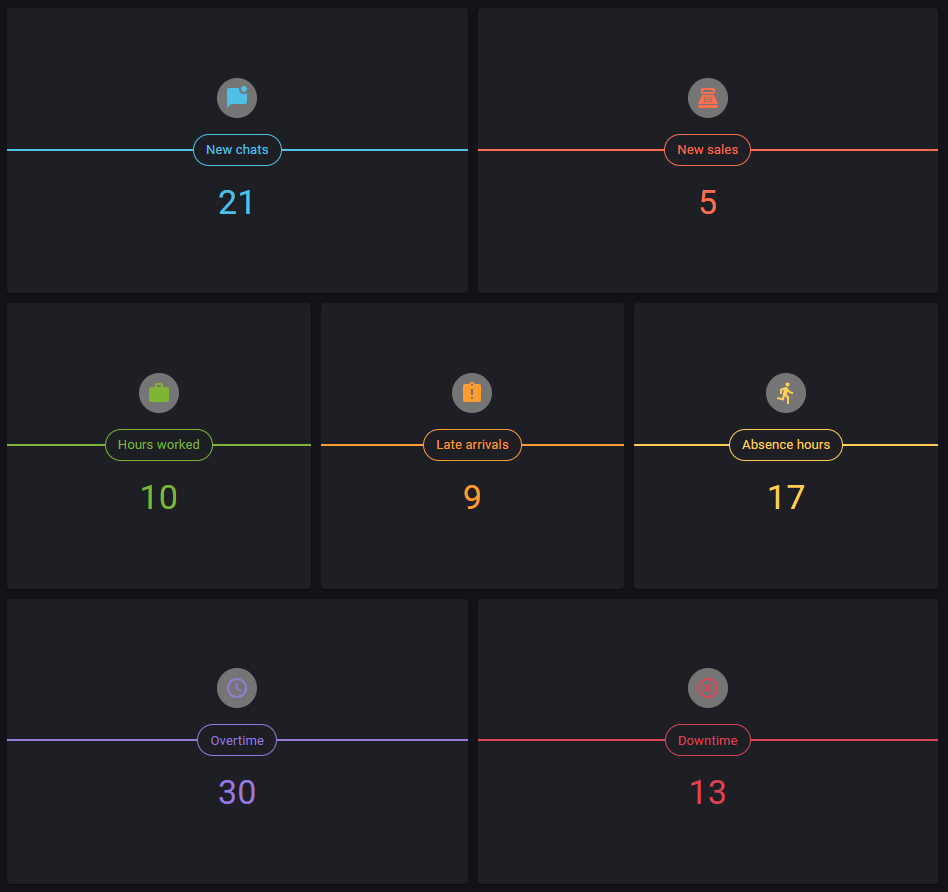

# KPI Review

> Link to [the playground](https://react-declarative-playground.github.io/)



## Description

A performance tracking dashboard which contains a grid of six squares, each represent different work-related metrics: `New chats`, `New sales`, `Hours worked`, `Late arrivals`, `Absentee hours`, `Overtime`, `Downtime`. The distinct color icons on each square correspond to their respective categories

# Code

```tsx
import { TypedField, FieldType } from "react-declarative";

import { AccessTime } from '@mui/icons-material';
import { AssignmentLate } from '@mui/icons-material';
import { DirectionsRun } from '@mui/icons-material';
import { HighlightOff } from '@mui/icons-material';
import { MarkChatUnread } from '@mui/icons-material';
import { PointOfSale } from '@mui/icons-material';
import { Work } from '@mui/icons-material';

declare var IndicatorCard;

export const data = {
    indicatorValues: {
        newChats: 21,
        newSales: 5,
        hoursWorked: 10,
        lateArrivals: 9,
        abscenceHours: 17,
        overtime: 30,
        downTime: 13
    }
};

export const fields: TypedField[] = [
  {
    type: FieldType.Hero,
    columns: "6",
    phoneColumns: "12",
    phoneRight: '0px',
    height: `33vh`,
    right: '10px',
    bottom: '10px',
    child: {
      type: FieldType.Component,
      element: ({
        indicatorValues
      }) => (
        <IndicatorCard
          color="#4FC0E8"
          label='New chats'
          value={indicatorValues.newChats}
          icon={MarkChatUnread}
        />
      ),
    },
  },
  {
    type: FieldType.Hero,
    columns: "6",
    phoneColumns: "12",
    phoneRight: '0px',
    height: `33vh`,
    right: '10px',
    bottom: '10px',
    child: {
      type: FieldType.Component,
      element: ({
        indicatorValues
      }) => (
        <IndicatorCard
          color="#fc6e51"
          label='New sales'
          value={indicatorValues.newSales}
          icon={PointOfSale}
        />
      ),
    },
  },
  {
    type: FieldType.Hero,
    columns: "4",
    phoneColumns: "12",
    phoneRight: '0px',
    height: `33vh`,
    right: '10px',
    bottom: '10px',
    child: {
      type: FieldType.Component,
      element: ({
        indicatorValues
      }) => (
        <IndicatorCard
          color="#7FB537"
          label='Hours worked'
          value={indicatorValues.hoursWorked}
          icon={Work}
        />
      ),
    },
  },
  {
    type: FieldType.Hero,
    columns: "4",
    phoneColumns: "12",
    phoneRight: '0px',
    height: `33vh`,
    right: '10px',
    bottom: '10px',
    child: {
      type: FieldType.Component,
      element: ({
        indicatorValues
      }) => (
        <IndicatorCard
          color="#FE9B31"
          label='Late arrivals'
          value={indicatorValues.lateArrivals}
          icon={AssignmentLate}
        />
      ),
    },
  },
  {
    type: FieldType.Hero,
    columns: "4",
    phoneColumns: "12",
    phoneRight: '0px',
    height: `33vh`,
    right: '10px',
    bottom: '10px',
    child: {
      type: FieldType.Component,
      element: ({
        indicatorValues
      }) => (
        <IndicatorCard
          color="#ffce54"
          label='Absence hours'
          value={indicatorValues.abscenceHours}
          icon={DirectionsRun}
        />
      ),
    },
  },
  {
    type: FieldType.Hero,
    columns: "6",
    phoneColumns: "12",
    phoneRight: '0px',
    height: `33vh`,
    right: '10px',
    bottom: '10px',
    child: {
      type: FieldType.Component,
      element: ({
        indicatorValues
      }) => (
        <IndicatorCard
          color="#967adc"
          label='Overtime'
          value={indicatorValues.overtime}
          icon={AccessTime}
        />
      ),
    },
  },
  {
    type: FieldType.Hero,
    columns: "6",
    phoneColumns: "12",
    phoneRight: '0px',
    height: `33vh`,
    right: '10px',
    bottom: '10px',
    child: {
      type: FieldType.Component,
      element: ({
        indicatorValues
      }) => (
        <IndicatorCard
          color="#da4453"
          label='Downtime'
          value={indicatorValues.downTime}
          icon={HighlightOff}
        />
      ),
    },
  },
];

```
