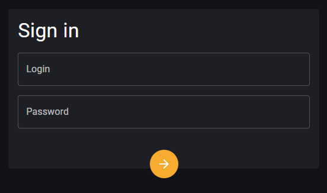

# Sign in form

> Link to [the playground](https://react-declarative-playground.github.io/)



## Description

There are two empty fields: one labeled “Login” and the other labeled “Password.” Below these fields is an orange button with a right-pointing arrow, presumably to submit the login information. Above the fields, in larger white text, is the instruction “Sign in.”

# Code

```tsx
import { TypedField, FieldType, ActionBounce, ActionState, Subject } from "react-declarative";

const sleep = (delay = 1_000) => new Promise<void>((res) => setTimeout(() => res(), delay))

const stateSubject = new Subject<ActionState>();

export const fields: TypedField[] = [
  {
    type: FieldType.Box,
    sx: {
      display: "flex",
      alignItems: "center",
      justifyContent: "center",
      height: '80vh',
    },
    child: {
      type: FieldType.Layout,
      customLayout: ({ children }) => (
        <ActionBounce transparentPaper stateSubject={stateSubject}>
          {children}
        </ActionBounce>
      ),
      child: {
        type: FieldType.Paper,
        sx: {
          width: "256px",
        },
        fields: [
          {
            type: FieldType.Typography,
            typoVariant: 'h4',
            placeholder: 'Sign in',
          },
          {
            type: FieldType.Text,
            fieldRightMargin: '0',
            fieldBottomMargin: '2',
            outlined: true,
            name: 'login',
          },
          {
            type: FieldType.Text,
            fieldRightMargin: '0',
            fieldBottomMargin: '1',
            outlined: true,
            inputType: 'password',
            name: 'password',
          },
          {
            type: FieldType.Box,
            sx: {
              minHeight: '28px',
            },
          },
          {
            type: FieldType.Icon,
            fieldRightMargin: '0',
            fieldBottomMargin: '0',
            iconBackground: 'warning',
            sx: {
              marginBottom: '-32px',
            },
            iconSize: 48,
            click: async (name, e, data) => {
              stateSubject.next(ActionState.Active);
              await sleep();
              stateSubject.next(ActionState.Succeed);
              await sleep();
              stateSubject.next(ActionState.Abort);
              alert(JSON.stringify(data, null, 2))
            },
          },
        ]
      },
    },
  },
];

```
