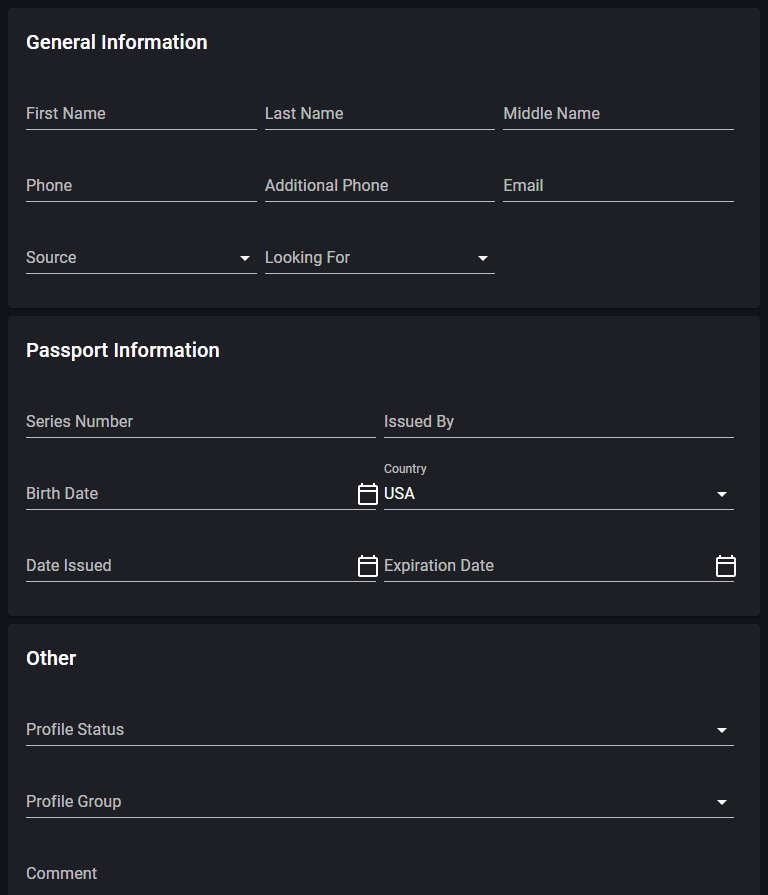

# Order info

> Link to [the playground](https://react-declarative-playground.github.io/)



## Description

The form is divided into three sections: “General Information,” “Passport Information,” and “Other.”

In the “General Information” section, there are fields for “First Name,” “Last Name,” “Middle Name,” “Phone,” an additional phone number option, and “Email.”

The “Passport Information” section has fields for entering details such as the country of issue (with a dropdown menu), the date issued, and expiration date (both with calendar icons).

Lastly, the section titled “Other” contains dropdown menus for “Profile Status” and “Profile Group.”

## Code

```tsx
import { TypedField, FieldType } from "react-declarative";

export const fields: TypedField[] = [
  {
    type: FieldType.Paper,
    fieldBottomMargin: "1",
    fields: [
      {
        type: FieldType.Typography,
        typoVariant: "h6",
        placeholder: "General Information",
      },
      {
        type: FieldType.Text,
        desktopColumns: "4",
        tabletColumns: "4",
        phoneColumns: "12",
        outlined: false,
        name: "first_name",
        title: 'First Name',
      },
      {
        type: FieldType.Text,
        desktopColumns: "4",
        tabletColumns: "4",
        phoneColumns: "12",
        outlined: false,
        name: "last_name",
        title: 'Last Name',
      },
      {
        type: FieldType.Text,
        desktopColumns: "4",
        tabletColumns: "4",
        phoneColumns: "12",
        outlined: false,
        name: "middle_name",
        title: "Middle Name",
      },
      {
        type: FieldType.Text,

        desktopColumns: "4",
        tabletColumns: "4",
        phoneColumns: "12",
        outlined: false,
        name: "phone",
        title: "Phone",
        inputFormatterAllowed: /^[0-9]/,
        inputFormatterTemplate: "000000000000000",
      },
      {
        type: FieldType.Text,
        desktopColumns: "4",
        tabletColumns: "4",
        phoneColumns: "12",
        outlined: false,
        name: "additional_phone",
        title: 'Additional Phone',
        inputFormatterAllowed: /^[0-9]/,
        inputFormatterTemplate: "000000000000000",
      },
      {
        type: FieldType.Text,
        desktopColumns: "4",
        tabletColumns: "4",
        phoneColumns: "12",
        outlined: false,
        name: "email",
        title: 'Email',
      },
      {
        type: FieldType.Items,
        desktopColumns: "4",
        tabletColumns: "4",
        phoneColumns: "12",
        outlined: false,
        name: "source",
        title: 'Source',
        itemList: ["Telegram", "Facebook", "Instagram"],
      },
      {
        type: FieldType.Items,
        desktopColumns: "4",
        tabletColumns: "4",
        phoneColumns: "12",
        outlined: false,
        name: "looking_for",
        title: "Looking For",
        itemList: ["House", "Garage"],
      },
    ],
  },
  {
    type: FieldType.Paper,
    fieldBottomMargin: "1",
    fields: [
      {
        type: FieldType.Typography,
        typoVariant: "h6",
        placeholder: "Passport Information",
      },
      {
        type: FieldType.Text,
        desktopColumns: "6",
        tabletColumns: "6",
        phoneColumns: "12",
        outlined: false,
        name: "series_number",
        title: "Series Number",
      },
      {
        type: FieldType.Text,
        desktopColumns: "6",
        tabletColumns: "6",
        phoneColumns: "12",
        outlined: false,
        name: "issued_by",
        title: "Issued By",
        inputFormatterAllowed: /^[0-9 A-Za-z]/,
        inputFormatterTemplate: "000000000000000",
      },
      {
        type: FieldType.Date,
        desktopColumns: "6",
        tabletColumns: "6",
        phoneColumns: "12",
        outlined: false,
        name: "birth_date",
        title: 'Birth Date',
      },
      {
        type: FieldType.Combo,
        desktopColumns: "6",
        tabletColumns: "6",
        phoneColumns: "12",
        outlined: false,
        name: "country",
        title: 'Country',
        defaultValue: "USA",
        itemList: [
          "USA",
          "Turkey",
          "China"
        ],
      },
      {
        type: FieldType.Date,
        desktopColumns: "6",
        tabletColumns: "6",
        phoneColumns: "12",
        outlined: false,
        name: "given_date_from",
        title: "Date Issued",
      },
      {
        type: FieldType.Date,
        desktopColumns: "6",
        tabletColumns: "6",
        phoneColumns: "12",
        outlined: false,
        name: "given_date_to",
        title: 'Expiration Date',
      },
    ],
  },
  {
    type: FieldType.Paper,
    fieldBottomMargin: "1",
    fields: [
      {
        type: FieldType.Typography,
        typoVariant: "h6",
        placeholder: "Other",
      },
      {
        type: FieldType.Combo,
        title: 'Profile Status',
        outlined: false,
        itemList: ["First contact", "Active", "Inactive"],
        name: "profile_status",
      },
      {
        type: FieldType.Items,
        outlined: false,
        itemList: ["Group 1"],
        name: "profile_group",
        title: 'Profile Group',
      },
      {
        type: FieldType.Text,
        outlined: false,
        name: "comment",
        title: 'Comment',
        inputRows: 3,
      },
    ],
  },
];

```