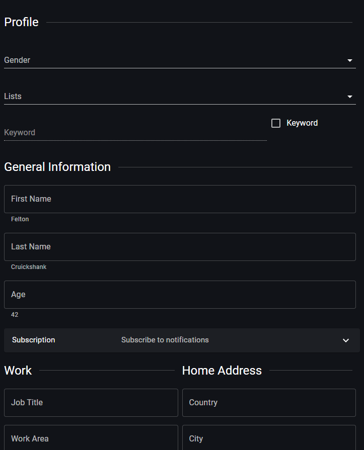

# Profile card

> Link to [the playground](https://react-declarative-playground.github.io/)



## Description

A user interface of a profile page

 - The profile page includes sections for personal information such as “Gender,” “First Name,” “Last Name,” and “Age.”

 - There are checkboxes for options like “Subscribe to notifications.”

 - There are fields for professional details under the headings “Job Title” and “Work Area.”

 - Additionally, there are placeholders for address information with fields labeled “Home Address” and “City.”

 - The design is clean, with a simple black-on-white color scheme, and uses dropdown menus and text boxes for input.

## Code

```tsx
import { TypedField, FieldType } from "react-declarative";

export const fields: TypedField[] = [
  {
    type: FieldType.Group,
    fields: [
      {
        type: FieldType.Group,
        fields: [
          {
            type: FieldType.Line,
            title: 'Profile'
          },
          {
            type: FieldType.Combo,
            title: 'Gender',
            placeholder: 'Select one',
            name: 'gender',
            itemList: ['Male', 'Female', 'Other']
          },
          {
            type: FieldType.Items,
            title: 'Lists',
            placeholder: 'Select multiple',
            name: 'list',
            itemList: ['Blocklist', 'VIP', 'Other people']
          },
          {
            type: FieldType.Group,
            fields: [
              {
                type: FieldType.Group,
                columns: "9",
                fields: [
                  {
                    type: FieldType.Text,
                    outlined: false,
                    title: 'Keyword',
                    name: 'keyword',
                    placeholder: 'September',
                    isDisabled: function (obj) { return !obj.keywordEnabled; }
                  },
                ]
              },
              {
                type: FieldType.Group,
                columns: "3",
                fields: [
                  {
                    type: FieldType.Checkbox,
                    title: 'Keyword',
                    name: 'keywordEnabled'
                  },
                ]
              },
            ]
          }
        ]
      },
      {
        type: FieldType.Line,
        title: 'General Information'
      },
      {
        name: 'firstName',
        type: FieldType.Text,
        outlined: true,
        title: 'First Name',
        description: 'Felton'
      },
      {
        name: 'lastName',
        type: FieldType.Text,
        outlined: true,
        title: 'Last Name',
        description: 'Cruickshank'
      },
      {
        name: 'age',
        type: FieldType.Text,
        outlined: true,
        title: 'Age',
        description: '42',
        isInvalid: function (obj) {
          var value = Number(obj.age);
          if (!Number.isInteger(value)) {
            return 'Age must be a number';
          }
          else if (value < 1) {
            return 'Age must be greater than 1';
          }
          else {
            return null;
          }
        }
      },
      {
        type: FieldType.Expansion,
        title: 'Subscription',
        description: 'Subscribe to notifications',
        fields: [
          {
            type: FieldType.Switch,
            name: 'subscribed',
            title: 'Allow Subscription'
          },
          {
            name: 'email',
            type: FieldType.Text,
            outlined: true,
            isDisabled: function (obj) { return !obj.subscribed; },
            isInvalid: function (_a) {
              var email = _a.email;
              var expr = /^[\w-\.]+@([\w-]+\.)+[\w-]{2,4}$/g;
              if (!expr.test(email)) {
                return 'Invalid email address provided';
              }
              else {
                return null;
              }
            },
            title: 'Email',
            description: 'tripolskypetr@gmail.com'
          },
        ]
      },
      {
        type: FieldType.Group,
        fields: [
          {
            type: FieldType.Group,
            columns: '6',
            fields: [
              {
                type: FieldType.Line,
                title: 'Work'
              },
              {
                name: 'jobTitle',
                type: FieldType.Text,
                outlined: true,
                title: 'Job Title'
              },
              {
                name: 'jobArea',
                type: FieldType.Text,
                outlined: true,
                title: 'Work Area'
              },
            ]
          },
          {
            type: FieldType.Group,
            columns: '6',
            fields: [
              {
                type: FieldType.Line,
                title: 'Home Address'
              },
              {
                name: 'country',
                type: FieldType.Text,
                outlined: true,
                title: 'Country'
              },
              {
                name: 'city',
                type: FieldType.Text,
                outlined: true,
                title: 'City'
              },
              {
                name: 'state',
                type: FieldType.Text,
                outlined: true,
                title: 'State'
              },
              {
                name: 'address',
                type: FieldType.Text,
                outlined: true,
                title: 'Address'
              },
            ]
          },
        ]
      },
    ]
  }
];
```
