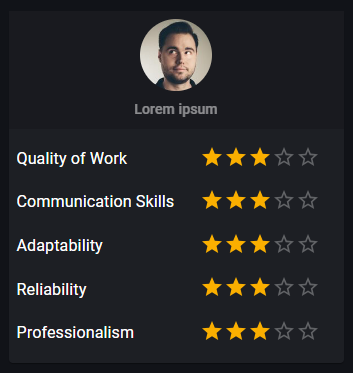

# Rate card

> Link to [the playground](https://react-declarative-playground.github.io/)



## Description

A freelancer performance review form. Here’s a breakdown of what it shows:

1. Profile Picture Placeholder

2. Placeholder Text: The text “Lorem ipsum” is used, which is common for placeholder text.

3. Categories and Ratings: The form evaluates five categories, each with a five-star rating system:

 - Quality of Work: 5 stars
 - Communication Skills: 4 stars
 - Adaptability: 3 stars
 - Reliability: 5 stars
 - Professionalism: 2 stars

## Code

```tsx
import { TypedField, FieldType, PaperView } from "react-declarative";

import { Avatar, Box, Typography, darken } from "@mui/material";

const AVATAR_SIDE = 72;
const AVATAR_SRC = "/image/1.jpg";

const createRateRow = ({
  name,
  title,
}): TypedField => ({
  type: FieldType.Box,
  sx: {
    display: 'grid',
    gridTemplateColumns: 'auto 1fr auto',
    alignItems: 'center',
  },
  fields: [
    {
      type: FieldType.Typography,
      fieldBottomMargin: '0',
      typoVariant: 'body1',
      placeholder: title,
    },
    {
      type: FieldType.Div,
    },
    {
      type: FieldType.Rating,
      fieldBottomMargin: '0',
      fieldRightMargin: '0',
      name,
    }
  ],
});

export const fields: TypedField[] = [
  {
    type: FieldType.Box,
    sx: {
      display: "flex",
      alignItems: "center",
      justifyContent: "center",
      height: '80vh',
    },
    child: {
      type: FieldType.Layout,
      customLayout: ({ children }) => (
        <PaperView sx={{ width: "335px" }}>
          {children}
        </PaperView>
      ),
      fields:  [
          {
            type: FieldType.Component,
            element: () => (
              <Box
                sx={{
                    background: (theme) => darken(theme.palette.background.paper, 0.13),
                    display: 'flex',
                    alignItems: 'center',
                    flexDirection: 'column',
                    gap: 1,
                    p: 1,
                }}
              >
                <Avatar
                  sx={{ 
                    height: AVATAR_SIDE, 
                    width: AVATAR_SIDE,
                  }}
                  src={AVATAR_SRC}
                />
                <Typography variant="subtitle2" sx={{  opacity: 0.5 }}>
                  Lorem ipsum
                </Typography>
              </Box>
            ),
          },
          {
            type: FieldType.Layout,
            customLayout: ({ children }) => (
              <Box p={1}>
                {children}
              </Box>
            ),
            fields: [
              createRateRow({
                name: 'quality',
                title: 'Quality of Work',
              }),
              createRateRow({
                name: 'communication',
                title: 'Communication Skills',
              }),
              createRateRow({
                name: 'adaptability',
                title: 'Adaptability',
              }),
              createRateRow({
                name: 'reliability',
                title: 'Reliability',
              }),
              createRateRow({
                name: 'professionalism',
                title: 'Professionalism',
              }),
            ],
          },
        ],
    },
  },
];
```
