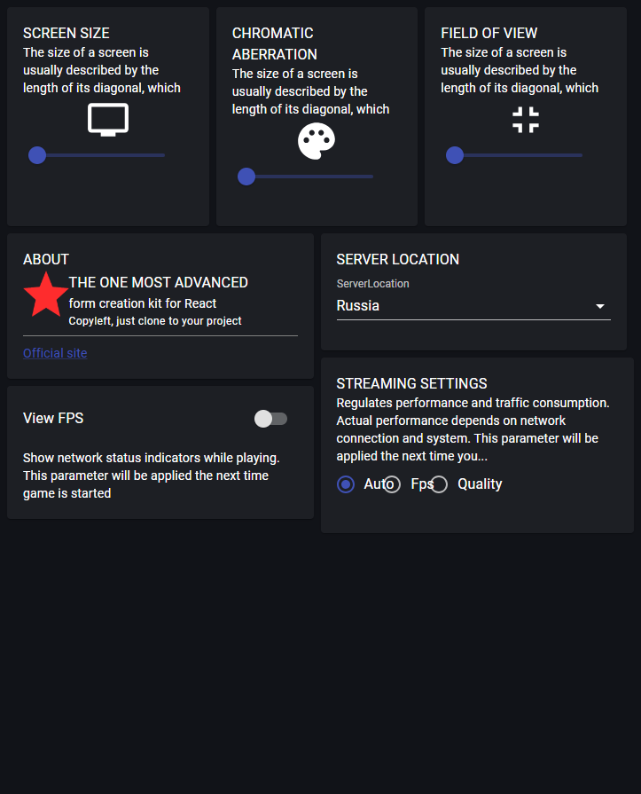

# Settings page

> Link to [the playground](https://react-declarative-playground.github.io/)



## Description

An interface with various settings related to a screen or display. Here’s a detailed breakdown:

 - SCREEN SIZE: This section has an icon representing screen dimensions. The toggle switch for this feature is in the off position.
 - CHROMATIC ABERRATION: This section has an icon depicting color dispersion. The toggle switch for this feature is also in the off position.
 - FIELD OF VIEW: This section has an icon indicating the extent of the observable area. The toggle switch for this feature is in the off position.
 - SERVER LOCATION: This section has an icon symbolizing network connectivity. The toggle switch for this feature is in the on position, indicating that this feature is active or enabled.

Below these sections, there are two buttons: one labeled “Official site” suggesting a link to a website, and another labeled “View FPS” which means Frames Per Second

At the bottom of the page, there is text stating that game network status indicators will play when the game is started, implying that this interface could be related to video game settings.

## Code

```tsx
import { TypedField, FieldType } from "react-declarative";

import {
  Box,
  Link,
  Typography,
} from "@mui/material";
import {
  Tv,
  Palette,
  FullscreenExit,
} from '@mui/icons-material';

const Hr = () => <Box style={{ height: '1px', background: '#808080', margin: '5px 0px 10px 0' }} />;
const Logo = () => ;

const createDimension = (title, icon): TypedField => ({
  type: FieldType.Paper,
  noBaseline: true,
  fieldRightMargin: '1',
  fieldBottomMargin: '1',
  phoneColumns: '12',
  columns: '4',
  fields: [
    {
      type: FieldType.Typography,
      typoVariant: 'body1',
      placeholder: title.toUpperCase(),
      fieldRightMargin: "1",
      fieldBottomMargin: "0",
    },
    {
      type: FieldType.Typography,
      typoVariant: 'body2',
      style: {
        fontWeight: '300',
        maxHeight: '60px',
        overflow: 'hidden',
      },
      placeholder: `
            The size of a screen is  usually  described by the  length of its 
            diagonal, which is the distance between opposite corners, usually 
            in inches. It is also sometimes called the physical image size
          `,
    },
    {
      type: FieldType.Component,
      fieldBottomMargin: "0",
      element: () => (
        <Box display="flex" justifyContent="center">
          {React.createElement(icon, { style: { fontSize: '50px' } })}
        </Box>
      ),
    },
    {
      type: FieldType.Slider,
    },
  ],
});

export const fields: TypedField[] = [
  {
    type: FieldType.Group,
    noBaseline: true,
    fields: [
      {
        type: FieldType.Group,
        noBaseline: true,
        sx: (theme) => ({
          [theme.breakpoints.up("sm")]: {
            '& > *': {
              minHeight: '100%',
            },
          },
        }),
        fields: [
          createDimension('Screen size', Tv),
          createDimension('Chromatic aberration', Palette),
          createDimension('Field of view', FullscreenExit),
        ],
      },
      {
        type: FieldType.Group,
        noBaseline: true,
        phoneColumns: '12',
        columns: '6',
        fields: [
          {
            type: FieldType.Paper,
            fieldBottomMargin: '1',
            fieldRightMargin: '1',
            fields: [
              {
                type: FieldType.Component,
                element: () => <Typography variant="body1">ABOUT</Typography>,
              },
              {
                type: FieldType.Component,
                columns: '2',
                style: { maxWidth: '64px' },
                element: Logo,
              },
              {
                type: FieldType.Group,
                columns: '10',
                fields: [
                  {
                    type: FieldType.Component,
                    element: () => (
                      <Box display="flex" flexDirection="column">
                        <Typography variant="subtitle1">THE ONE MOST ADVANCED</Typography>
                        <Typography variant="body2">form creation kit for React</Typography>
                        <Typography variant="caption">Copyleft, just clone to your project</Typography>
                      </Box>
                    ),
                  },
                ],
              },
              {
                type: FieldType.Component,
                element: () => (
                  <Box display="flex" flexDirection="column">
                    <Hr />
                    <Typography variant="body2">
                      <Link href="https://theonekit.com" target="_blank">Official site</Link>
                    </Typography>
                  </Box>
                ),
              },
            ],
          },
          {
            type: FieldType.Paper,
            fieldBottomMargin: '1',
            fieldRightMargin: '1',
            fields: [
              {
                type: FieldType.Switch,
                name: 'isViewFps',
                title: 'View FPS',
                fieldRightMargin: '0',
              },
              {
                type: FieldType.Component,
                element: () => (
                  <Typography variant="body2">
                    Show network status indicators while playing. This parameter
                    will be applied the next time game is started
                  </Typography>
                ),
              }
            ],
          },
        ],
      },
      {
        type: FieldType.Group,
        phoneColumns: '12',
        columns: '6',
        fields: [
          {
            type: FieldType.Paper,
            fieldRightMargin: '1',
            fieldBottomMargin: '1',
            fields: [
              {
                type: FieldType.Component,
                element: () => <Typography>SERVER LOCATION</Typography>,
              },
              {
                type: FieldType.Combo,
                name: 'serverLocation',
                fieldRightMargin: '0',
                outlined: false,
                defaultValue: 'Russia',
                itemList: [
                  'Russia',
                  'Usa',
                  'China',
                ],
              },
            ],
          },
          {
            type: FieldType.Paper,
            fields: [
              {
                type: FieldType.Component,
                element: () => (
                  <Box display="flex" flexDirection="column">
                    <Typography variant="body1">STREAMING SETTINGS</Typography>
                    <Typography variant="body2">
                      Regulates performance and traffic consumption. Actual performance
                      depends on network connection and system. This parameter will be
                      applied the next time you...
                    </Typography>
                  </Box>
                ),
              },
              {
                type: FieldType.Radio,
                radioValue: 'auto',
                fieldRightMargin: "1",
                phoneColumns: '6',
                tabletColumns: '2',
                name: 'streamingType',
                defaultValue: 'auto',
                title: 'Auto',
              },
              {
                type: FieldType.Radio,
                radioValue: 'fps',
                fieldRightMargin: "1",
                phoneColumns: '6',
                tabletColumns: '2',
                name: 'streamingType',
                title: 'Fps',
              },
              {
                type: FieldType.Radio,
                radioValue: 'quality',
                fieldRightMargin: "1",
                phoneColumns: '6',
                tabletColumns: '2',
                name: 'streamingType',
                title: 'Quality',
              },
            ],
          },
        ],
      },
    ]
  },
];

```