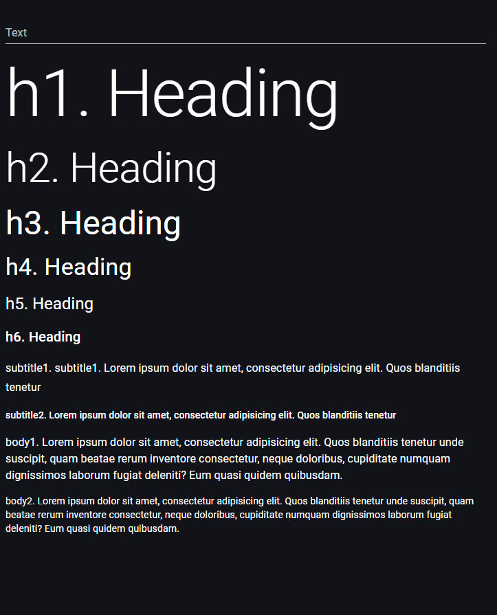

# Typography

> Link to [the playground](https://react-declarative-playground.github.io/)



## Description

A visual guide to different heading levels and text styles typically used in web design or document formatting. 

 - It displays a series of headings and subheadings in different sizes and styles, showcasing various font weights and hierarchies.
 - The largest text at the top is labeled “h1. Heading,” followed by progressively smaller headings labeled “h2. Heading” through “h6. Heading.”
 - Below each heading, there are subheadings or paragraphs of lorem ipsum text, which is placeholder text commonly used in the graphic design and typesetting industry to demonstrate the visual form of a document without relying on meaningful content.

This form provides a clear example of how different heading levels are styled for visual hierarchy, which is crucial for organizing content in a way that allows readers to easily navigate through information. It’s a useful reference for anyone working with web design or document formatting. 

## Code

```tsx
import { IField, FieldType } from "react-declarative";

export const fields: IField[] = [
    {
        type: FieldType.Text,
        placeholder: 'User text',
        name: 'text',
    },
    {
        type: FieldType.Typography,
        typoVariant: 'h1',
        name: 'text',
        placeholder: 'h1. Heading',
    },
    {
        type: FieldType.Typography,
        typoVariant: 'h2',
        name: 'text',
        placeholder: 'h2. Heading',
    },
    {
        type: FieldType.Typography,
        typoVariant: 'h3',
        name: 'text',
        placeholder: 'h3. Heading',
    },
    {
        type: FieldType.Typography,
        typoVariant: 'h4',
        name: 'text',
        placeholder: 'h4. Heading',
    },
    {
        type: FieldType.Typography,
        typoVariant: 'h5',
        name: 'text',
        placeholder: 'h5. Heading',
    },
    {
        type: FieldType.Typography,
        typoVariant: 'h6',
        name: 'text',
        placeholder: 'h6. Heading',
    },
    {
        type: FieldType.Typography,
        typoVariant: 'subtitle1',
        name: 'text',
        placeholder: 'subtitle1. subtitle1. Lorem ipsum dolor sit amet, consectetur adipisicing elit. Quos blanditiis tenetur',
    },
    {
        type: FieldType.Typography,
        typoVariant: 'subtitle2',
        name: 'text',
        placeholder: 'subtitle2. Lorem ipsum dolor sit amet, consectetur adipisicing elit. Quos blanditiis tenetur',
    },
    {
        type: FieldType.Typography,
        typoVariant: 'body1',
        name: 'text',
        placeholder: `body1. Lorem ipsum dolor sit amet, consectetur adipisicing elit. Quos blanditiis tenetur
          unde suscipit, quam beatae rerum inventore consectetur, neque doloribus, cupiditate numquam
          dignissimos laborum fugiat deleniti? Eum quasi quidem quibusdam.`,
    },
    {
        type: FieldType.Typography,
        typoVariant: 'body2',
        name: 'text',
        placeholder: `body2. Lorem ipsum dolor sit amet, consectetur adipisicing elit. Quos blanditiis tenetur
          unde suscipit, quam beatae rerum inventore consectetur, neque doloribus, cupiditate numquam
          dignissimos laborum fugiat deleniti? Eum quasi quidem quibusdam.`,
    },
];

```